# 🏗️ Diagrama de Arquitetura — TetusManager v4

## 📊 Arquitetura Geral do Sistema

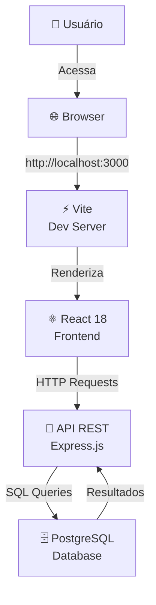

---

## 🎯 Fluxo de Requisição (Registrar Corte)

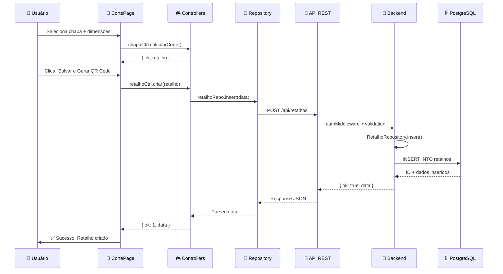

---

## 🗂️ Estrutura de Pastas & Responsabilidades

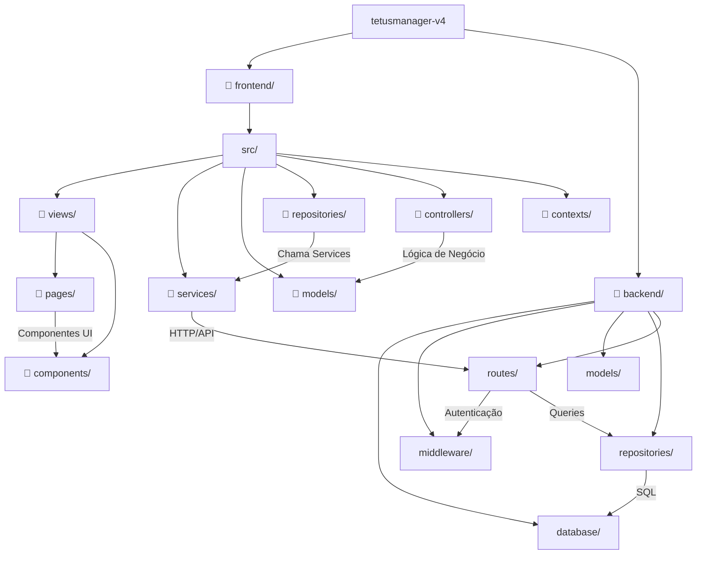

---

## 🗄️ Modelo de Dados (ER - Entity Relationship)

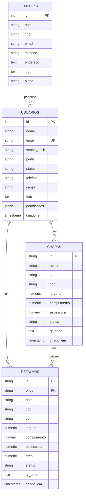

---

## 🔑 Autenticação & Permissões

```mermaid
flowchart LR
    Login["🔐 Login<br/>POST /api/auth/login"]
    Token["🔑 JWT Token<br/>8h expiração"]
    Storage["💾 localStorage<br/>tetus_token"]
    Request["📤 HTTP Request<br/>Authorization: Bearer"]
    Middleware["✅ AuthMiddleware<br/>Validação JWT"]
    Permissions["🛡️ requirePerm()"]
    Route["🔌 Rota Protegida"]
    
    Login -->|Senha OK| Token
    Token -->|Armazena| Storage
    Storage -->|Envia em cada| Request
    Request -->|Middleware valida| Middleware
    Middleware -->|Verifica| Permissions
    Permissions -->|Acesso OK| Route
```

---

## 📋 Fluxo CRUD — Retalhos

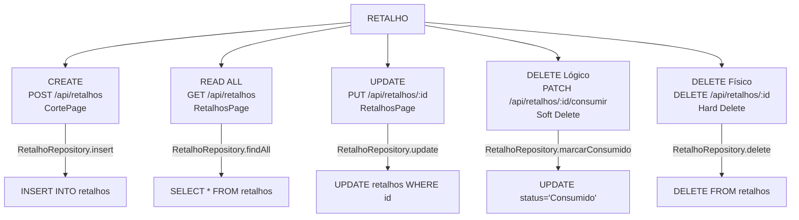

---

## 🎮 Controllers & Repositories Stack

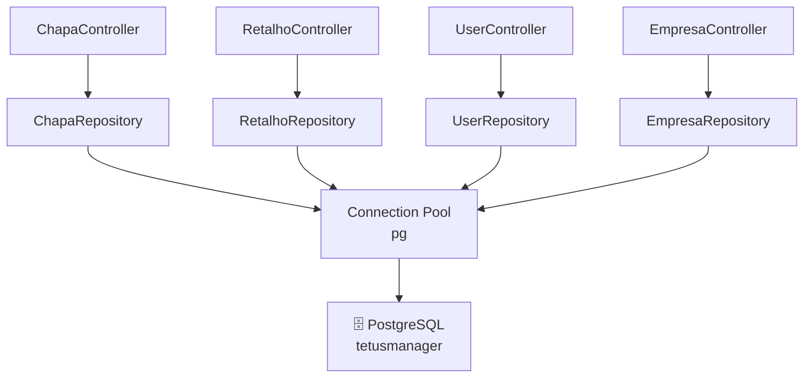

---

## 👥 Papéis & Permissões

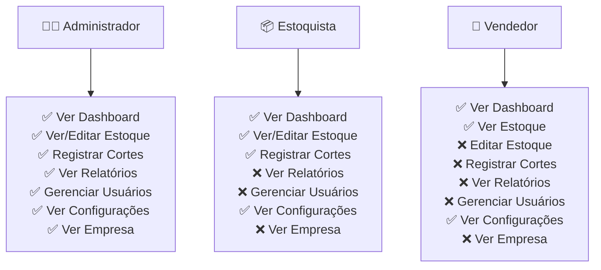

---

## 🔌 Endpoints da API

```mermaid
graph TB
    API["🔌 /api"]
    
    AUTH["🔐 Auth"]
    CHAPAS["📊 Chapas"]
    CORTES["✂️ Cortes"]
    RETALHOS["📦 Retalhos"]
    USUARIOS["👥 Usuários"]
    EMPRESA["🏢 Empresa"]
    ME["👤 Me"]
    
    API --> AUTH
    API --> CHAPAS
    API --> CORTES
    API --> RETALHOS
    API --> USUARIOS
    API --> EMPRESA
    API --> ME
    
    AUTH -->|POST /auth/login| Login["Login"]
    
    CHAPAS -->|GET| GetChapas["Listar"]
    CHAPAS -->|POST| CreateChapa["Criar"]
    CHAPAS -->|PUT /:id| UpdateChapa["Atualizar"]
    CHAPAS -->|DELETE /:id| DeleteChapa["Excluir"]
    
    CORTES -->|POST| RegisterCorte["Registrar Corte"]
    
    RETALHOS -->|GET| GetRetalhos["Listar"]
    RETALHOS -->|POST| CreateRetalho["Criar"]
    RETALHOS -->|PUT /:id| UpdateRetalho["Atualizar"]
    RETALHOS -->|PATCH /:id/consumir| ConsumeRetalho["Soft Delete"]
    RETALHOS -->|DELETE /:id| DeleteRetalho["Hard Delete"]
    
    USUARIOS -->|GET| GetUsers["Listar"]
    USUARIOS -->|POST| CreateUser["Criar"]
    USUARIOS -->|PATCH /:id/toggle| ToggleUser["Ativar/Inativar"]
    USUARIOS -->|PATCH /:id/permissoes| UpdatePerms["Alterar Permissões"]
    USUARIOS -->|DELETE /:id| DeleteUser["Excluir"]
    
    EMPRESA -->|GET| GetEmpresa["Buscar"]
    EMPRESA -->|PUT| UpdateEmpresa["Atualizar"]
    
    ME -->|GET| GetMe["Meu Perfil"]
    ME -->|PATCH /perfil| UpdateMe["Atualizar Perfil"]
    ME -->|PATCH /senha| ChangePwd["Alterar Senha"]
```

---

## 🧩 Componentes React

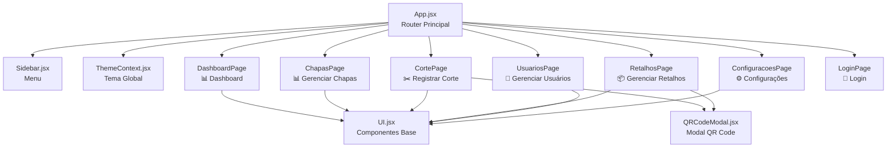

---

## 🔄 Ciclo de Vida — Criar Retalho (Registrar Corte)

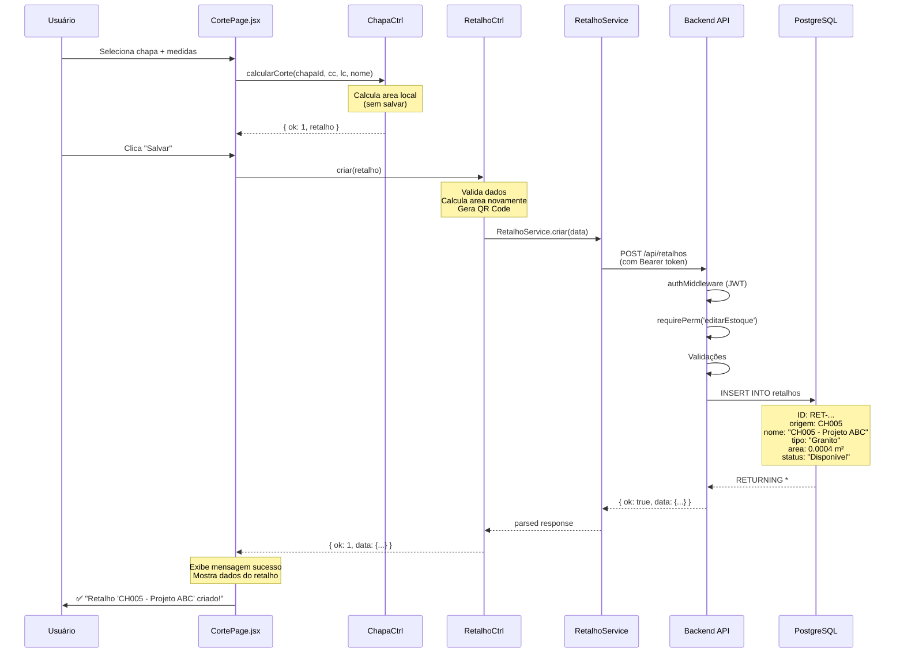

---

## 📁 Pastas & Responsabilidades Detalhadas

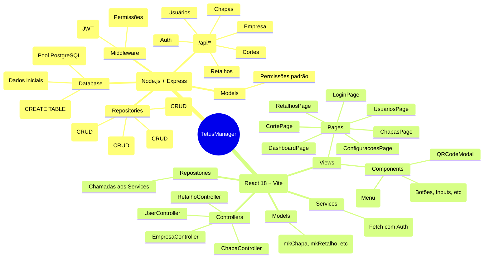

---

## 🎯 Fluxos Principais

### 1️⃣ **Registrar Corte (CortePage)**
```
Usuário seleciona chapa → calcularCorte() → Visualiza sobra
→ Clica "Salvar" → criar() → API POST /api/retalhos
→ PostgreSQL INSERT → Sucesso!
```

### 2️⃣ **Listar Retalhos (RetalhosPage)**
```
Usuário acessa página → retalhoCtrl.listar()
→ RetalhoService.listar() → GET /api/retalhos
→ PostgreSQL SELECT * → Mapeia para mkRetalho()
→ Renderiza grid
```

### 3️⃣ **Login (LoginPage)**
```
Usuário insere email/senha → api.login()
→ POST /api/auth/login → Backend valida senha (bcrypt)
→ Gera JWT com permissões → localStorage.setItem('tetus_token')
→ Redireciona para Dashboard
```

### 4️⃣ **Consumir Retalho (Soft Delete)**
```
Usuário marca retalho como "Consumido"
→ marcarConsumido() → PATCH /api/retalhos/:id/consumir
→ UPDATE status='Consumido' (não deleta, apenas marca)
```

---

## 🔐 Segurança

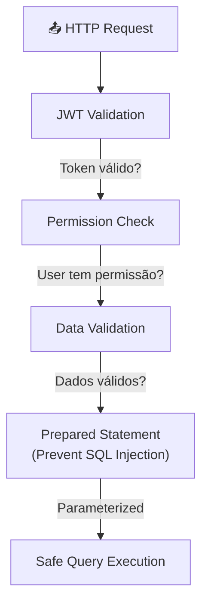

---

**Gerado em:** 2026-05-15
**Stack:** React 18 + Node.js/Express + PostgreSQL
**Versão:** 4.0

