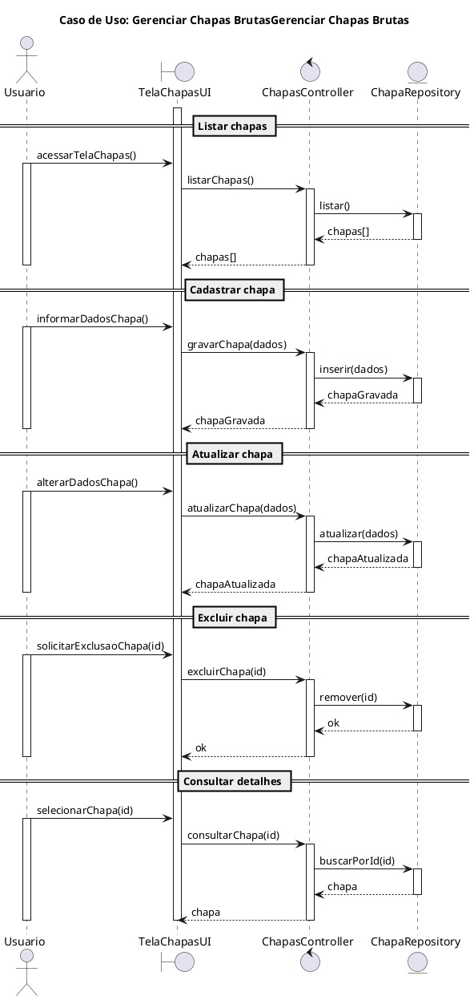
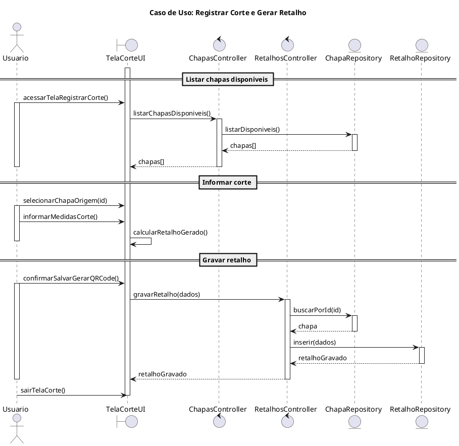

# Diagramas de Sequencia (Requisitos do Professor)

## Caso de Uso: Gerenciar Chapas Brutas



## Caso de Uso: Registrar Corte e Gerar Retalho



````
This is the description of what the code block changes:
<changeDescription>
Adiciona uma ação explícita de saída da tela para finalizar a UI no caso de corte e manter a vela de vida coerente.
</changeDescription>

