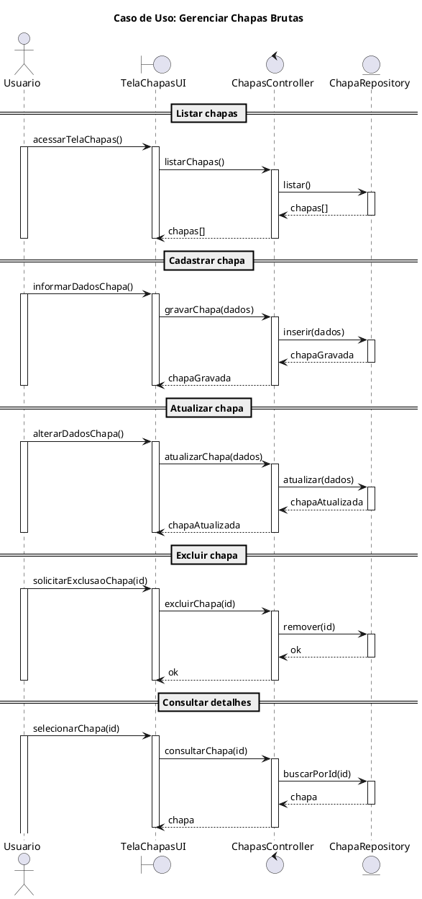
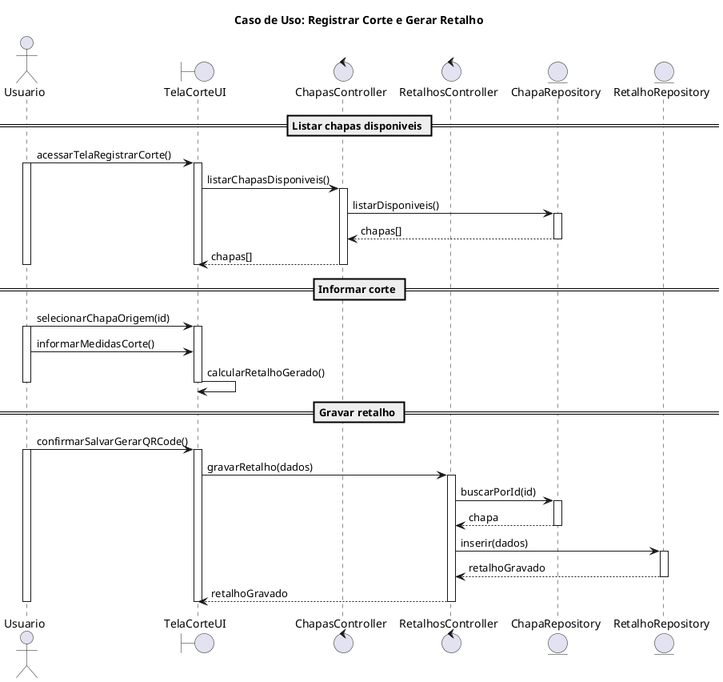

# Diagramas de Sequencia (Requisitos do Professor)

## Caso de Uso: Gerenciar Chapas Brutas

```plantuml
@startuml
title Caso de Uso: Gerenciar Chapas Brutas
actor Usuario
boundary UI as "TelaChapasUI"
control ChapasCtrl as "ChapasController"
entity ChapaRepo as "ChapaRepository"
== Listar chapas ==
 Usuario -> UI: acessarTelaChapas()
 activate Usuario
activate UI
 UI -> ChapasCtrl: listarChapas()
 activate ChapasCtrl
ChapasCtrl -> ChapaRepo: listar()
activate ChapaRepo
ChapaRepo --> ChapasCtrl: chapas[]
deactivate ChapaRepo
ChapasCtrl --> UI: chapas[]
deactivate ChapasCtrl
deactivate UI
 deactivate Usuario
 == Cadastrar chapa ==
 Usuario -> UI: informarDadosChapa()
 activate Usuario
activate UI
 UI -> ChapasCtrl: gravarChapa(dados)
 activate ChapasCtrl
ChapasCtrl -> ChapaRepo: inserir(dados)
activate ChapaRepo
ChapaRepo --> ChapasCtrl: chapaGravada
deactivate ChapaRepo
ChapasCtrl --> UI: chapaGravada
deactivate ChapasCtrl
deactivate UI
 deactivate Usuario
 == Atualizar chapa ==
 Usuario -> UI: alterarDadosChapa()
 activate Usuario
activate UI
 UI -> ChapasCtrl: atualizarChapa(dados)
 activate ChapasCtrl
ChapasCtrl -> ChapaRepo: atualizar(dados)
activate ChapaRepo
ChapaRepo --> ChapasCtrl: chapaAtualizada
deactivate ChapaRepo
ChapasCtrl --> UI: chapaAtualizada
deactivate ChapasCtrl
deactivate UI
 deactivate Usuario
 == Excluir chapa ==
 Usuario -> UI: solicitarExclusaoChapa(id)
 activate Usuario
activate UI
 UI -> ChapasCtrl: excluirChapa(id)
 activate ChapasCtrl
ChapasCtrl -> ChapaRepo: remover(id)
activate ChapaRepo
ChapaRepo --> ChapasCtrl: ok
deactivate ChapaRepo
ChapasCtrl --> UI: ok
deactivate ChapasCtrl
deactivate UI
 deactivate Usuario
 == Consultar detalhes ==
 Usuario -> UI: selecionarChapa(id)
 activate Usuario
activate UI
 UI -> ChapasCtrl: consultarChapa(id)
 activate ChapasCtrl
ChapasCtrl -> ChapaRepo: buscarPorId(id)
activate ChapaRepo
ChapaRepo --> ChapasCtrl: chapa
deactivate ChapaRepo
ChapasCtrl --> UI: chapa
deactivate ChapasCtrl
deactivate UI
 @enduml
```

## Caso de Uso: Registrar Corte e Gerar Retalho

```plantuml
@startuml
title Caso de Uso: Registrar Corte e Gerar Retalho
actor Usuario
boundary UI as "TelaCorteUI"
control ChapasCtrl as "ChapasController"
control RetalhosCtrl as "RetalhosController"
entity ChapaRepo as "ChapaRepository"
entity RetalhoRepo as "RetalhoRepository"
== Listar chapas disponiveis ==
 Usuario -> UI: acessarTelaRegistrarCorte()
 activate Usuario
activate UI
 UI -> ChapasCtrl: listarChapasDisponiveis()
 activate ChapasCtrl
ChapasCtrl -> ChapaRepo: listarDisponiveis()
activate ChapaRepo
ChapaRepo --> ChapasCtrl: chapas[]
deactivate ChapaRepo
ChapasCtrl --> UI: chapas[]
deactivate ChapasCtrl
deactivate UI
 deactivate Usuario
 == Informar corte ==
 Usuario -> UI: selecionarChapaOrigem(id)
 activate Usuario
activate UI
 Usuario -> UI: informarMedidasCorte()
 UI -> UI: calcularRetalhoGerado()
deactivate UI
 deactivate Usuario
 == Gravar retalho ==
 Usuario -> UI: confirmarSalvarGerarQRCode()
 activate Usuario
activate UI
 UI -> RetalhosCtrl: gravarRetalho(dados)
 activate RetalhosCtrl
RetalhosCtrl -> ChapaRepo: buscarPorId(id)
activate ChapaRepo
ChapaRepo --> RetalhosCtrl: chapa
deactivate ChapaRepo
RetalhosCtrl -> RetalhoRepo: inserir(dados)
activate RetalhoRepo
RetalhoRepo --> RetalhosCtrl: retalhoGravado
deactivate RetalhoRepo
RetalhosCtrl --> UI: retalhoGravado
deactivate RetalhosCtrl
deactivate UI
 deactivate Usuario
 @enduml
```

