# 🏗️ Diagrama de Classes — TetusManager v4

## 📊 Diagrama Completo de Classes UML

```mermaid
classDiagram
    %% ════════════════════════════════════════════════════════════
    %% BACKEND — Node.js/Express
    %% ════════════════════════════════════════════════════════════
    
    class Router {
        -express.Router router
        +post(path: string, ...middlewares, handler)
        +get(path: string, ...middlewares, handler)
        +put(path: string, ...middlewares, handler)
        +patch(path: string, ...middlewares, handler)
        +delete(path: string, ...middlewares, handler)
    }
    
    class AuthMiddleware {
        +authMiddleware(req, res, next): void
        +requirePerm(permission: string): middleware
        -verifyJWT(token: string): payload
        -checkPermission(user, required): boolean
    }
    
    class ChapaRepository {
        -pool: pg.Pool
        +insert(data: ChapaData): Promise~Chapa~
        +findAll(filtro: string): Promise~Chapa[]~
        +findById(id: string): Promise~Chapa~
        +update(id: string, data: ChapaData): Promise~Chapa~
        +delete(id: string): Promise~Chapa~
        +stats(): Promise~ChapaStats~
        -toModel(row): Chapa
    }
    
    class RetalhoRepository {
        -pool: pg.Pool
        +insert(data: RetalhoData): Promise~Retalho~
        +findAll(filtro: string): Promise~Retalho[]~
        +findById(id: string): Promise~Retalho~
        +update(id: string, data: RetalhoData): Promise~Retalho~
        +delete(id: string): Promise~Retalho~
        +marcarConsumido(id: string): Promise~Retalho~
        +stats(): Promise~RetalhoStats~
        -toModel(row): Retalho
        -gerarId(): string
        -buildRetalhoQrPayload(data): string
    }
    
    class UserRepository {
        -pool: pg.Pool
        +insert(data: UserData): Promise~User~
        +findAll(filtro: string): Promise~User[]~
        +findById(id: number): Promise~User~
        +findByEmail(email: string): Promise~User~
        +update(id: number, data: UserData): Promise~User~
        +updateFull(id: number, data: UserData): Promise~User~
        +updateSenha(id: number, senha: string): Promise~void~
        +updatePermissoes(id: number, perms: object): Promise~User~
        +toggleStatus(id: number): Promise~User~
        +delete(id: number): Promise~User~
        -toModel(row): User
        -hashPassword(senha: string): string
    }
    
    class EmpresaRepository {
        -pool: pg.Pool
        +get(): Promise~Empresa~
        +update(data: EmpresaData): Promise~Empresa~
        -toModel(row): Empresa
    }
    
    class Chapa {
        -id: string
        -nome: string
        -tipo: string
        -cor: string
        -largura: number
        -comprimento: number
        -espessura: number
        -status: string
        -qrCode: string
        -criadoEm: Date
        -atualizadoEm: Date
    }
    
    class Retalho {
        -id: string
        -origem: string
        -nome: string
        -tipo: string
        -cor: string
        -largura: number
        -comprimento: number
        -espessura: number
        -area: number
        -status: string
        -qrCode: string
        -criadoEm: Date
        -atualizadoEm: Date
    }
    
    class Usuario {
        -id: number
        -nome: string
        -email: string
        -senhaHash: string
        -perfil: string
        -status: string
        -telefone: string
        -cargo: string
        -foto: string
        -permissoes: object
        -criadoEm: Date
        -atualizadoEm: Date
    }
    
    class Empresa {
        -id: number
        -nome: string
        -cnpj: string
        -email: string
        -telefone: string
        -endereco: string
        -logo: string
        -plano: string
        -fundacao: string
    }
    
    class PermissoesModelo {
        +PERMISSOES_PADRAO: object
        -Administrador: Permissao
        -Estoquista: Permissao
        -Vendedor: Permissao
        +verDashboard: boolean
        +verEstoque: boolean
        +editarEstoque: boolean
        +registrarCorte: boolean
        +verRelatorios: boolean
        +gerenciarUsuarios: boolean
        +verConfiguracoes: boolean
        +verEmpresa: boolean
    }
    
    class ConnectionPool {
        -pg.Pool pool
        +query(sql: string, params: array): Promise~Result~
        +getClient(): Promise~Client~
        +close(): Promise~void~
    }
    
    %% ════════════════════════════════════════════════════════════
    %% FRONTEND — React.js
    %% ════════════════════════════════════════════════════════════
    
    class App {
        -token: string
        -user: Usuario
        -theme: object
        +render(): JSX
        +handleLogin(email, senha): void
        +handleLogout(): void
    }
    
    class ChapaController {
        -repository: IChapaRepository
        +criar(data): Promise~Result~
        +listar(filtro): Promise~Result~
        +buscar(id): Promise~Result~
        +atualizar(id, data): Promise~Result~
        +excluir(id): Promise~Result~
        +calcularCorte(chapaId, cc, lc, nome): Result
        +stats(): Promise~ChapaStats~
        -validarDados(data): boolean
    }
    
    class RetalhoController {
        -repository: IRetalhoRepository
        +criar(data): Promise~Result~
        +listar(filtro): Promise~Result~
        +buscar(id): Promise~Result~
        +atualizar(id, data): Promise~Result~
        +excluir(id): Promise~Result~
        +marcarConsumido(id): Promise~Result~
        +stats(): Promise~RetalhoStats~
        -validarDados(data): boolean
        -calcularArea(comprimento, largura): number
    }
    
    class UserController {
        -repository: IUserRepository
        +criar(data): Promise~Result~
        +listar(filtro): Promise~Result~
        +buscar(id): Promise~Result~
        +atualizar(id, data): Promise~Result~
        +toggleStatus(id): Promise~Result~
        +excluir(id): Promise~Result~
        +atualizarPermissoes(id, perms): Promise~Result~
        +resetarPermissoes(id): Promise~Result~
        +atualizarPerfil(id, data): Promise~Result~
        -validarEmail(email): boolean
        -hashPassword(senha: string): string
    }
    
    class EmpresaController {
        -repository: IEmpresaRepository
        +buscar(): Promise~Result~
        +atualizar(data): Promise~Result~
    }
    
    class ChapaService {
        -baseUrl: string
        -token: string
        +listar(q): Promise~Response~
        +buscar(id): Promise~Response~
        +stats(): Promise~Response~
        +criar(data): Promise~Response~
        +atualizar(id, data): Promise~Response~
        +excluir(id): Promise~Response~
        -apiFetch(path, options): Promise~JSON~
    }
    
    class RetalhoService {
        -baseUrl: string
        -token: string
        +listar(q): Promise~Response~
        +buscar(id): Promise~Response~
        +stats(): Promise~Response~
        +criar(data): Promise~Response~
        +atualizar(id, data): Promise~Response~
        +marcarConsumido(id): Promise~Response~
        +excluir(id): Promise~Response~
        -apiFetch(path, options): Promise~JSON~
    }
    
    class UsuarioService {
        -baseUrl: string
        -token: string
        +listar(q): Promise~Response~
        +buscar(id): Promise~Response~
        +criar(data): Promise~Response~
        +atualizar(id, data): Promise~Response~
        +toggleStatus(id): Promise~Response~
        +atualizarPermissoes(id, perms): Promise~Response~
        +resetarPermissoes(id): Promise~Response~
        +excluir(id): Promise~Response~
        +meuPerfil(): Promise~Response~
        +atualizarMeuPerfil(data): Promise~Response~
        +alterarSenha(atual, nova): Promise~Response~
        -apiFetch(path, options): Promise~JSON~
    }
    
    class AutopService {
        +login(email, senha): Promise~Response~
        +logout(): void
        +getToken(): string
        +setToken(token): void
    }
    
    class ChapaRepository_Front {
        -service: ChapaService
        +findAll(filtro): Promise~Chapa[]~
        +findById(id): Promise~Chapa~
        +insert(data): Promise~Chapa~
        +update(id, data): Promise~Chapa~
        +delete(id): Promise~Chapa~
        +stats(): Promise~ChapaStats~
    }
    
    class RetalhoRepository_Front {
        -service: RetalhoService
        +findAll(filtro): Promise~Retalho[]~
        +findById(id): Promise~Retalho~
        +insert(data): Promise~Retalho~
        +update(id, data): Promise~Retalho~
        +delete(id): Promise~Retalho~
        +marcarConsumido(id): Promise~Retalho~
        +stats(): Promise~RetalhoStats~
    }
    
    class ModeloChapa {
        +mkChapa(data): Chapa
        +TIPOS_ROCHA: string[]
        -validarCorpo(data): boolean
    }
    
    class ModeloRetalho {
        +mkRetalho(data): Retalho
        +STATUS_RETALHO: string[]
        -validarCorpo(data): boolean
    }
    
    class ModeloUsuario {
        +mkUser(data): Usuario
        +PERFIS_USUARIO: string[]
        -validarCorpo(data): boolean
    }
    
    class DashboardPage {
        -stats: object
        -loading: boolean
        +useEffect(): void
        +render(): JSX
        -carregarDados(): Promise~void~
    }
    
    class ChapasPage {
        -chapas: Chapa[]
        -form: object
        -loading: boolean
        +render(): JSX
        +handleCriar(data): Promise~void~
        +handleAtualizar(id, data): Promise~void~
        +handleExcluir(id): Promise~void~
        -carregarChapas(): Promise~void~
    }
    
    class CortePage {
        -form: object
        -chapas: Chapa[]
        -done: object
        -loading: boolean
        +render(): JSX
        +handleSalvar(): Promise~void~
        -carregarChapas(): Promise~void~
    }
    
    class RetalhosPage {
        -retalhos: Retalho[]
        -form: object
        -loading: boolean
        +render(): JSX
        +handleCriar(data): Promise~void~
        +handleAtualizar(id, data): Promise~void~
        +handleConsumir(id): Promise~void~
        +handleExcluir(id): Promise~void~
        -carregarRetalhos(): Promise~void~
    }
    
    class UsuariosPage {
        -usuarios: Usuario[]
        -form: object
        -loading: boolean
        +render(): JSX
        +handleCriar(data): Promise~void~
        +handleAtualizar(id, data): Promise~void~
        +handleToggle(id): Promise~void~
        +handleExcluir(id): Promise~void~
        -carregarUsuarios(): Promise~void~
    }
    
    class ConfiguracoesPage {
        -empresa: Empresa
        -usuario: Usuario
        -loading: boolean
        +render(): JSX
        +handleAtualizarEmpresa(data): Promise~void~
        +handleAtualizarPerfil(data): Promise~void~
        +handleAlterarSenha(atual, nova): Promise~void~
        -carregarDados(): Promise~void~
    }
    
    class LoginPage {
        -form: object
        -loading: boolean
        +render(): JSX
        +handleLogin(): Promise~void~
        -validarForm(): boolean
    }
    
    class Sidebar {
        -user: Usuario
        -menus: MenuItem[]
        +render(): JSX
        +handleNavegar(rota): void
        +handleLogout(): void
        -filtrarMenusPorPermissao(user): MenuItem[]
    }
    
    class QRCodeModal {
        -data: object
        -visible: boolean
        +render(): JSX
        +handleClose(): void
        +handleDownload(qrCode): void
        -gerarQRCode(payload): string
    }
    
    class UI {
        +FormField(label, children): JSX
        +BtnPrimary(props, children): JSX
        +BtnSecondary(props, children): JSX
        +BtnDanger(props, children): JSX
        +CrudLabel(op): JSX
        +Input(props): JSX
        +Select(props): JSX
        +Textarea(props): JSX
    }
    
    class ThemeContext {
        -theme: object
        -toggleTheme(): void
        +useTheme(): object
    }
    
    %% ════════════════════════════════════════════════════════════
    %% RELACIONAMENTOS
    %% ════════════════════════════════════════════════════════════
    
    %% Backend Relationships
    Router --> AuthMiddleware : usa
    Router --> ChapaRepository : chama
    Router --> RetalhoRepository : chama
    Router --> UserRepository : chama
    Router --> EmpresaRepository : chama
    
    ChapaRepository --> Chapa : retorna
    RetalhoRepository --> Retalho : retorna
    UserRepository --> Usuario : retorna
    EmpresaRepository --> Empresa : retorna
    
    ChapaRepository --> ConnectionPool : usa
    RetalhoRepository --> ConnectionPool : usa
    UserRepository --> ConnectionPool : usa
    EmpresaRepository --> ConnectionPool : usa
    
    UserRepository --> PermissoesModelo : usa
    
    Retalho --> Chapa : origem referencia
    
    %% Frontend Relationships
    App --> DashboardPage : renderiza
    App --> ChapasPage : renderiza
    App --> CortePage : renderiza
    App --> RetalhosPage : renderiza
    App --> UsuariosPage : renderiza
    App --> ConfiguracoesPage : renderiza
    App --> LoginPage : renderiza
    App --> Sidebar : renderiza
    App --> ThemeContext : usa
    
    ChapaController --> ChapaRepository_Front : usa
    RetalhoController --> RetalhoRepository_Front : usa
    UserController --> UserRepository_Front : usa
    EmpresaController --> EmpresaRepository_Front : usa
    
    ChapaRepository_Front --> ChapaService : chama
    RetalhoRepository_Front --> RetalhoService : chama
    UserRepository_Front --> UsuarioService : chama
    EmpresaRepository_Front --> EmpresaService : chama
    
    ChapaService --> AutopService : usa token
    RetalhoService --> AutopService : usa token
    UsuarioService --> AutopService : usa token
    
    DashboardPage --> ChapaController : usa
    DashboardPage --> RetalhoController : usa
    
    ChapasPage --> ChapaController : usa
    ChapasPage --> ModeloChapa : mapeia
    ChapasPage --> UI : componentes
    
    CortePage --> ChapaController : usa
    CortePage --> RetalhoController : usa
    CortePage --> ModeloChapa : mapeia
    CortePage --> QRCodeModal : renderiza
    CortePage --> UI : componentes
    
    RetalhosPage --> RetalhoController : usa
    RetalhosPage --> ModeloRetalho : mapeia
    RetalhosPage --> QRCodeModal : renderiza
    RetalhosPage --> UI : componentes
    
    UsuariosPage --> UserController : usa
    UsuariosPage --> ModeloUsuario : mapeia
    UsuariosPage --> UI : componentes
    
    ConfiguracoesPage --> EmpresaController : usa
    ConfiguracoesPage --> UserController : usa
    ConfiguracoesPage --> UI : componentes
    
    LoginPage --> AutopService : login
    LoginPage --> UI : componentes
    
    Sidebar --> App : navega
    Sidebar --> UI : componentes
    
    QRCodeModal --> UI : componentes
    
    ModeloChapa --> Chapa : valida
    ModeloRetalho --> Retalho : valida
    ModeloUsuario --> Usuario : valida
    ModeloUsuario --> PermissoesModelo : usa
```



---

## 📋 Descrição Detalhada das Classes

### **BACKEND**

#### **ChapaRepository**
```typescript
class ChapaRepository {
  // Operações CRUD para chapas
  async insert(data: {
    nome: string
    tipo: string
    cor: string
    largura: number
    comprimento: number
    espessura: number
  }): Promise<Chapa>
  
  async findAll(filtro?: string): Promise<Chapa[]>
  async findById(id: string): Promise<Chapa | null>
  async update(id: string, data: Partial<Chapa>): Promise<Chapa>
  async delete(id: string): Promise<Chapa>
  async stats(): Promise<{
    total: number
    disponiveis: number
    emUso: number
    esgotadas: number
  }>
}
```

#### **RetalhoRepository**
```typescript
class RetalhoRepository {
  // Operações CRUD para retalhos
  async insert(data: {
    origem?: string
    nome: string
    tipo: string
    cor: string
    largura: number
    comprimento: number
    espessura?: number
    area: number
  }): Promise<Retalho>
  
  async findAll(filtro?: string): Promise<Retalho[]>
  async findById(id: string): Promise<Retalho | null>
  async update(id: string, data: Partial<Retalho>): Promise<Retalho>
  async delete(id: string): Promise<Retalho>
  async marcarConsumido(id: string): Promise<Retalho>
  async stats(): Promise<{
    total: number
    disponiveis: number
    reservados: number
    consumidos: number
    areaTotal: number
  }>
}
```

#### **UserRepository**
```typescript
class UserRepository {
  // Operações CRUD para usuários
  async insert(data: {
    nome: string
    email: string
    perfil: 'Administrador' | 'Estoquista' | 'Vendedor'
    permissoes?: object
  }): Promise<Usuario>
  
  async findAll(filtro?: string): Promise<Usuario[]>
  async findById(id: number): Promise<Usuario | null>
  async findByEmail(email: string): Promise<Usuario | null>
  async update(id: number, data: Partial<Usuario>): Promise<Usuario>
  async updateSenha(id: number, novaSenha: string): Promise<void>
  async updatePermissoes(id: number, perms: object): Promise<Usuario>
  async toggleStatus(id: number): Promise<Usuario>
  async delete(id: number): Promise<Usuario>
}
```

#### **EmpresaRepository**
```typescript
class EmpresaRepository {
  // Dados únicos da empresa
  async get(): Promise<Empresa>
  async update(data: Partial<Empresa>): Promise<Empresa>
}
```

---

### **FRONTEND**

#### **ChapaController**
```typescript
class ChapaController {
  constructor(private repository: ChapaRepository) {}
  
  async criar(data: {
    nome: string
    tipo: string
    largura: number
    comprimento: number
  }): Promise<{ ok: 1 | 0, data?: Chapa, msg: string }>
  
  async listar(filtro?: string): Promise<{ ok: 1 | 0, data: Chapa[] }>
  
  calcularCorte(
    chapaId: string,
    comprimentoConsumido: number,
    larguraConsumida: number,
    nomeProjeto?: string
  ): { ok: 1 | 0, retalho?: Retalho, msg: string }
  
  async stats(): Promise<ChapaStats>
}
```

#### **RetalhoController**
```typescript
class RetalhoController {
  constructor(private repository: RetalhoRepository) {}
  
  async criar(data: {
    nome: string
    origem?: string
    comprimento: number
    largura: number
    tipo?: string
    cor?: string
    espessura?: number
  }): Promise<{ ok: 1 | 0, data?: Retalho, msg: string }>
  
  async listar(filtro?: string): Promise<{ ok: 1 | 0, data: Retalho[] }>
  
  async marcarConsumido(id: string): Promise<{ ok: 1 | 0, data?: Retalho, msg: string }>
  
  async stats(): Promise<RetalhoStats>
}
```

#### **Services**
```typescript
// Frontend Services - Chamam a API REST
class ChapaService {
  static async listar(q?: string): Promise<ApiResponse>
  static async criar(data: object): Promise<ApiResponse>
  static async atualizar(id: string, data: object): Promise<ApiResponse>
  static async excluir(id: string): Promise<ApiResponse>
}

class RetalhoService {
  static async listar(q?: string): Promise<ApiResponse>
  static async criar(data: object): Promise<ApiResponse>
  static async marcarConsumido(id: string): Promise<ApiResponse>
  static async excluir(id: string): Promise<ApiResponse>
}
```

#### **Pages**
```typescript
// React Components - Páginas principais
class DashboardPage extends React.Component {
  state = { stats: null, loading: true }
  componentDidMount() { this.carregarDados() }
  render(): JSX
}

class CortePage extends React.Component {
  state = { form: {}, chapas: [], done: null }
  handleSalvar(): Promise<void>
  render(): JSX
}

class RetalhosPage extends React.Component {
  state = { retalhos: [], form: {}, loading: true }
  handleCriar(data): Promise<void>
  handleConsumir(id): Promise<void>
  render(): JSX
}

class UsuariosPage extends React.Component {
  state = { usuarios: [], form: {}, loading: true }
  handleCriar(data): Promise<void>
  handleToggle(id): Promise<void>
  render(): JSX
}
```

---

## 🔄 Fluxos de Dados

### **1. Registrar Corte**
```
CortePage.handleSalvar()
    ↓
RetalhoController.criar(calc.retalho)
    ↓
RetalhoRepository_Front.insert(data)
    ↓
RetalhoService.criar(data)
    ↓
fetch POST /api/retalhos + Bearer token
    ↓
Backend: Router → AuthMiddleware → requirePerm('editarEstoque')
    ↓
RetalhoRepository.insert(data)
    ↓
INSERT INTO retalhos (PostgreSQL)
    ↓
RETURNING * (dados salvos)
    ↓
Response { ok: true, data: Retalho }
    ↓
CortePage.setDone(r.data)
    ↓
Sucesso! ✅
```

### **2. Login**
```
LoginPage.handleLogin(email, senha)
    ↓
AuthService.login(email, senha)
    ↓
fetch POST /api/auth/login { email, senha }
    ↓
Backend: Router → UserRepository.findByEmail(email)
    ↓
bcrypt.compare(senha, senhaHash)
    ↓
jwt.sign({ user data }, JWT_SECRET, { expiresIn: '8h' })
    ↓
Response { ok: true, token, user }
    ↓
localStorage.setItem('tetus_token', token)
    ↓
Redireciona para Dashboard
    ↓
Sucesso! ✅
```

### **3. Listar Retalhos**
```
RetalhosPage.componentDidMount()
    ↓
RetalhoController.listar()
    ↓
RetalhoRepository_Front.findAll()
    ↓
RetalhoService.listar()
    ↓
fetch GET /api/retalhos
    ↓
Backend: Router → AuthMiddleware → requirePerm('verEstoque')
    ↓
RetalhoRepository.findAll(filtro)
    ↓
SELECT * FROM retalhos (PostgreSQL)
    ↓
Response { ok: true, data: Retalho[] }
    ↓
RetalhoController mapeia com mkRetalho()
    ↓
RetalhosPage.setState({ retalhos: data })
    ↓
Renderiza grid de retalhos
```

---

## 🔐 Autenticação & Autorização

```
Browser Request
    ↓
Authorization: Bearer <JWT_TOKEN>
    ↓
authMiddleware(req, res, next)
    ├─ Extrai token do header
    ├─ jwt.verify(token, JWT_SECRET)
    ├─ Decodifica payload { id, nome, email, perfil, permissoes }
    ├─ req.user = payload
    └─ next()
    ↓
requirePerm('editarEstoque')(req, res, next)
    ├─ Verifica req.user.permissoes.editarEstoque
    ├─ Se true → next()
    └─ Se false → res.status(403).json({ ok: false, msg: 'Sem permissão' })
    ↓
Handler executa ou retorna erro
```

---

## 📦 Relacionamentos Principais

### **Composição/Agregação**
- **RetalhoRepository** usa **ConnectionPool** (obrigatório)
- **CortePage** usa **RetalhoController** (obrigatório)
- **RetalhoController** usa **RetalhoRepository** (obrigatório)

### **Dependência/Associação**
- **Retalho** referencia **Chapa** (FK: origem)
- **Usuario** tem **Permissoes** (JSONB)
- **Router** usa **AuthMiddleware** (middleware)

### **Herança/Implementação**
- Todos os Controllers implementam padrão CRUD
- Todas as Services implementam padrão HTTP

---

## 🎯 Padrões de Design Utilizados

1. **Repository Pattern** ✅
   - ChapaRepository, RetalhoRepository, etc.

2. **Controller Pattern** ✅
   - ChapaController, RetalhoController, etc.

3. **Service Layer Pattern** ✅
   - ChapaService, RetalhoService (Frontend)

4. **Middleware Pattern** ✅
   - authMiddleware, requirePerm

5. **Factory Pattern** ✅
   - mkChapa(), mkRetalho(), mkUser()

6. **Singleton Pattern** ✅
   - ConnectionPool (uma instância)
   - localStorage para token

---

**Gerado em:** 2026-05-15  
**Total de Classes:** 30+  
**Lines of Code (estimado):** 3000+  
**Padrões de Design:** 6

