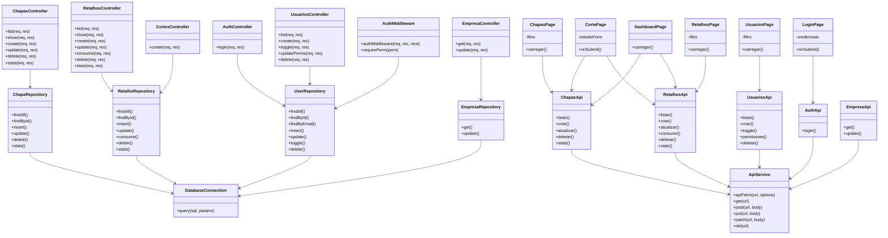

# Diagrama de Classes Minimalista (Backend + Frontend)

> Objetivo: diagrama enxuto com **atributos principais** e **relacionamentos entre classes**.

```mermaid
classDiagram
%% =========================
%% Backend (Node/Express)
%% =========================

class AuthController {
  +login(req, res)
}

class ChapasController {
  +list(req, res)
  +show(req, res)
  +create(req, res)
  +update(req, res)
  +delete(req, res)
  +stats(req, res)
}

class RetalhosController {
  +list(req, res)
  +show(req, res)
  +create(req, res)
  +update(req, res)
  +consume(req, res)
  +delete(req, res)
  +stats(req, res)
}

class CortesController {
  +create(req, res)
}

class UsuariosController {
  +list(req, res)
  +create(req, res)
  +toggle(req, res)
  +updatePerms(req, res)
  +delete(req, res)
}

class EmpresaController {
  +get(req, res)
  +update(req, res)
}

class ChapaRepository {
  +findAll()
  +findById()
  +insert()
  +update()
  +delete()
  +stats()
}

class RetalhoRepository {
  +findAll()
  +findById()
  +insert()
  +update()
  +consume()
  +delete()
  +stats()
}

class UserRepository {
  +findAll()
  +findById()
  +findByEmail()
  +insert()
  +update()
  +toggle()
  +delete()
}

class EmpresaRepository {
  +get()
  +update()
}

class AuthMiddleware {
  +authMiddleware(req, res, next)
  +requirePerm(perm)
}

class DatabaseConnection {
  +query(sql, params)
}

%% =========================
%% Frontend (React)
%% =========================

class ApiService {
  +apiFetch(url, options)
  +get(url)
  +post(url, body)
  +put(url, body)
  +patch(url, body)
  +del(url)
}

class ChapasApi {
  +listar()
  +criar()
  +atualizar()
  +deletar()
  +stats()
}

class RetalhosApi {
  +listar()
  +criar()
  +atualizar()
  +consumir()
  +deletar()
  +stats()
}

class UsuariosApi {
  +listar()
  +criar()
  +toggle()
  +permissoes()
  +deletar()
}

class AuthApi {
  +login()
}

class EmpresaApi {
  +get()
  +update()
}

class CortePage {
  -estadoForm
  +onSubmit()
}

class ChapasPage {
  -filtro
  +carregar()
}

class RetalhosPage {
  -filtro
  +carregar()
}

class UsuariosPage {
  -filtro
  +carregar()
}

class DashboardPage {
  +carregar()
}

class LoginPage {
  -credenciais
  +onSubmit()
}

%% =========================
%% Relacionamentos
%% =========================

AuthController --> UserRepository
ChapasController --> ChapaRepository
RetalhosController --> RetalhoRepository
CortesController --> RetalhoRepository
UsuariosController --> UserRepository
EmpresaController --> EmpresaRepository

AuthMiddleware --> UserRepository
ChapaRepository --> DatabaseConnection
RetalhoRepository --> DatabaseConnection
UserRepository --> DatabaseConnection
EmpresaRepository --> DatabaseConnection

ChapasApi --> ApiService
RetalhosApi --> ApiService
UsuariosApi --> ApiService
AuthApi --> ApiService
EmpresaApi --> ApiService

CortePage --> ChapasApi
CortePage --> RetalhosApi
ChapasPage --> ChapasApi
RetalhosPage --> RetalhosApi
UsuariosPage --> UsuariosApi
DashboardPage --> ChapasApi
DashboardPage --> RetalhosApi
LoginPage --> AuthApi
```

