# 📊 Diagrama de Classes Unificado — Backend + Frontend

Este diagrama reúne as classes principais do **backend** e do **frontend** em um único Mermaid, sem precisar juntar pastas.

```mermaid
classDiagram
direction TB
  %% =========================
  %% BACKEND
  %% =========================
  class AuthController {
    +login(req, res, next)
  }

  class ChapasController {
    +list(req, res, next)
    +show(req, res, next)
    +stats(req, res, next)
    +create(req, res, next)
    +update(req, res, next)
    +delete(req, res, next)
  }

  class RetalhosController {
    +list(req, res, next)
    +show(req, res, next)
    +stats(req, res, next)
    +create(req, res, next)
    +update(req, res, next)
    +consume(req, res, next)
    +delete(req, res, next)
  }

  class CortesController {
    +registrar(req, res, next)
  }

  class UsuariosController {
    +list(req, res, next)
    +show(req, res, next)
    +create(req, res, next)
    +update(req, res, next)
    +updatePermissions(req, res, next)
    +resetPermissions(req, res, next)
    +toggle(req, res, next)
    +delete(req, res, next)
    +me(req, res, next)
    +updateProfile(req, res, next)
    +changePassword(req, res, next)
  }

  class EmpresaController {
    +show(req, res, next)
    +update(req, res, next)
  }

  class ChapaRepository {
    +insert(data)
    +findAll(filtro)
    +findById(id)
    +update(id, data)
    +delete(id)
    +stats()
  }

  class RetalhoRepository {
    +insert(data)
    +findAll(filtro)
    +findById(id)
    +update(id, data)
    +delete(id)
    +marcarConsumido(id)
    +stats()
  }

  class UserRepository {
    +insert(data)
    +findAll(filtro)
    +findById(id)
    +findByEmail(email)
    +update(id, data)
    +updateFull(id, data)
    +updateSenha(id, senha)
    +updatePermissoes(id, perms)
    +toggleStatus(id)
    +delete(id)
  }

  class EmpresaRepository {
    +get()
    +update(data)
  }

  %% =========================
  %% FRONTEND
  %% =========================
  class ChapaController_Front {
    +criar(data)
    +listar(filtro)
    +buscar(id)
    +atualizar(id, data)
    +excluir(id)
    +calcularCorte(cid, cc, lc, nome)
    +stats()
  }

  class RetalhoController_Front {
    +criar(data)
    +listar(filtro)
    +buscar(id)
    +atualizar(id, data)
    +excluir(id)
    +marcarConsumido(id)
    +stats()
  }

  class UserController_Front {
    +criar(data)
    +listar(filtro)
    +buscar(id)
    +atualizar(id, data)
    +toggleStatus(id)
    +excluir(id)
    +atualizarPermissoes(id, perms)
    +resetarPermissoes(id)
    +atualizarPerfil(id, data)
  }

  class EmpresaController_Front {
    +buscar()
    +atualizar(data)
  }

  class ChapaRepository_Front {
    +findAll(filtro)
    +findById(id)
    +insert(data)
    +update(id, data)
    +delete(id)
    +stats()
  }

  class RetalhoRepository_Front {
    +findAll(filtro)
    +findById(id)
    +insert(data)
    +update(id, data)
    +delete(id)
    +marcarConsumido(id)
    +stats()
  }

  class UserRepository_Front {
    +findAll(filtro)
    +findById(id)
    +insert(data)
    +update(id, data)
    +delete(id)
    +toggleStatus(id)
    +atualizarPermissoes(id, perms)
    +resetarPermissoes(id)
  }

  class EmpresaRepository_Front {
    +get()
    +update(data)
  }

  class ApiService {
    +apiFetch(path, options)
  }

  class ChapaService {
    +listar(q)
    +buscar(id)
    +stats()
    +criar(data)
    +atualizar(id, data)
    +excluir(id)
  }

  class RetalhoService {
    +listar(q)
    +buscar(id)
    +stats()
    +criar(data)
    +atualizar(id, data)
    +marcarConsumido(id)
    +excluir(id)
  }

  class UsuarioService {
    +listar(q)
    +buscar(id)
    +criar(data)
    +atualizar(id, data)
    +toggleStatus(id)
    +atualizarPermissoes(id, perms)
    +resetarPermissoes(id)
    +excluir(id)
    +meuPerfil()
    +atualizarMeuPerfil(data)
    +alterarSenha(atual, nova)
  }

  class EmpresaService {
    +buscar()
    +atualizar(data)
  }

  class CortePage {
    +handleSalvar()
  }

  class ChapasPage {
    +handleCriar()
    +handleAtualizar()
    +handleExcluir()
  }

  class RetalhosPage {
    +handleCriar()
    +handleAtualizar()
    +handleConsumir()
    +handleExcluir()
  }

  class UsuariosPage {
    +handleCriar()
    +handleAtualizar()
    +handleToggle()
    +handleExcluir()
  }

  class ConfiguracoesPage {
    +handleAtualizarEmpresa()
    +handleAtualizarPerfil()
    +handleAlterarSenha()
  }

  class LoginPage {
    +handleLogin()
  }

  %% =========================
  %% RELACIONAMENTOS
  %% =========================
  AuthController --> UserRepository
  ChapasController --> ChapaRepository
  RetalhosController --> RetalhoRepository
  CortesController --> ChapaRepository
  CortesController --> RetalhoRepository
  UsuariosController --> UserRepository
  EmpresaController --> EmpresaRepository

  ChapaController_Front --> ChapaRepository_Front
  RetalhoController_Front --> RetalhoRepository_Front
  UserController_Front --> UserRepository_Front
  EmpresaController_Front --> EmpresaRepository_Front

  ChapaRepository_Front --> ChapaService
  RetalhoRepository_Front --> RetalhoService
  UserRepository_Front --> UsuarioService
  EmpresaRepository_Front --> EmpresaService

  ChapaService --> ApiService
  RetalhoService --> ApiService
  UsuarioService --> ApiService
  EmpresaService --> ApiService

  CortePage --> ChapaController_Front
  CortePage --> RetalhoController_Front
  ChapasPage --> ChapaController_Front
  RetalhosPage --> RetalhoController_Front
  UsuariosPage --> UserController_Front
  ConfiguracoesPage --> EmpresaController_Front
  ConfiguracoesPage --> UserController_Front
  LoginPage --> ApiService
```

## ✅ Como visualizar

No IntelliJ:
- Abra `DIAGRAMA_CLASSES_UNIFICADO.md`
- Clique na aba **Preview**
