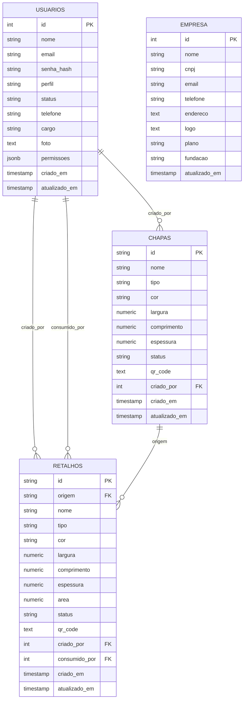

# Diagrama de Entidade (ER)

```mermaid
erDiagram
    USUARIOS ||--o{ CHAPAS : "criado_por"
    USUARIOS ||--o{ RETALHOS : "criado_por"
    USUARIOS ||--o{ RETALHOS : "consumido_por"
    CHAPAS ||--o{ RETALHOS : "origem"

    USUARIOS {
        int id PK
        string nome
        string email
        string senha_hash
        string perfil
        string status
        string telefone
        string cargo
        text foto
        jsonb permissoes
        timestamp criado_em
        timestamp atualizado_em
    }

    CHAPAS {
        string id PK
        string nome
        string tipo
        string cor
        numeric largura
        numeric comprimento
        numeric espessura
        string status
        text qr_code
        int criado_por FK
        timestamp criado_em
        timestamp atualizado_em
    }

    RETALHOS {
        string id PK
        string origem FK
        string nome
        string tipo
        string cor
        numeric largura
        numeric comprimento
        numeric espessura
        numeric area
        string status
        text qr_code
        int criado_por FK
        int consumido_por FK
        timestamp criado_em
        timestamp atualizado_em
    }

    EMPRESA {
        int id PK
        string nome
        string cnpj
        string email
        string telefone
        text endereco
        text logo
        string plano
        string fundacao
        timestamp atualizado_em
    }
```

