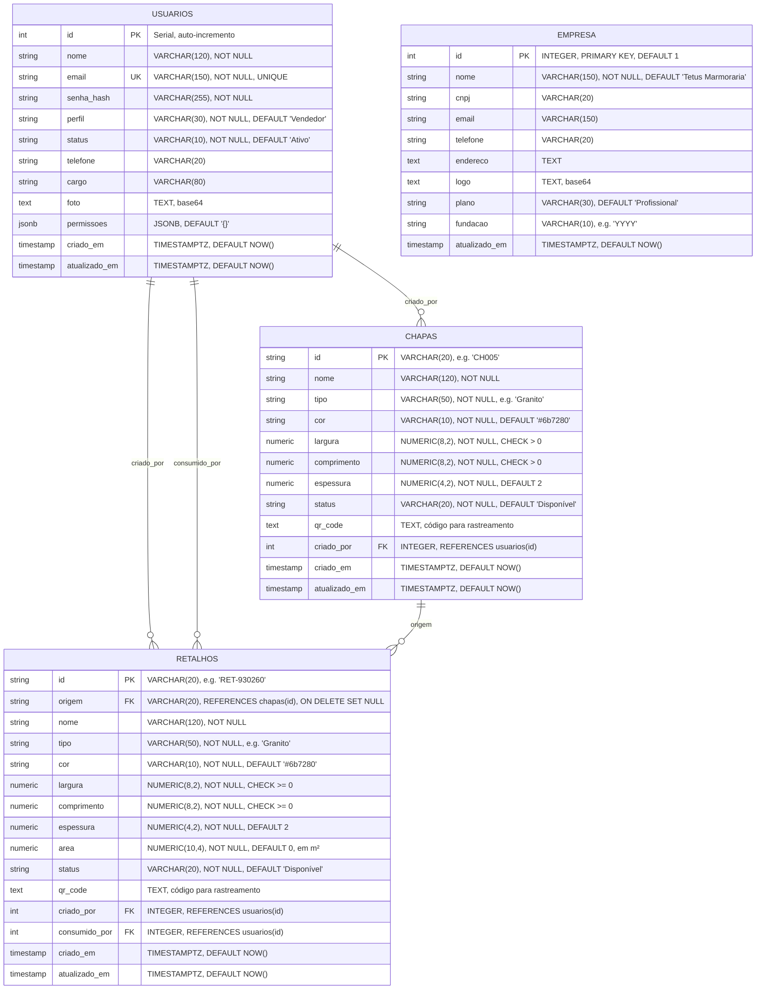

# 🗄️ Diagrama Entidade-Relacionamento (ER) — TetusManager v4

## 📊 Modelo de Dados Completo



---

## 🔗 Relacionamentos Detalhados

### 1️⃣ **USUARIOS → CHAPAS** (One-to-Many)
- Um usuário pode criar múltiplas chapas ✓
- **Foreign Key:** `chapas.criado_por` → `usuarios.id`
- **ON DELETE SET NULL:** se usuário for removido, a chapa mantém o registro

### 2️⃣ **USUARIOS → RETALHOS** (One-to-Many)
- Um usuário pode criar múltiplos retalhos ✓
- **Foreign Key:** `retalhos.criado_por` → `usuarios.id`

### 3️⃣ **USUARIOS → RETALHOS (consumo)** (One-to-Many)
- Um usuário pode consumir múltiplos retalhos ✓
- **Foreign Key:** `retalhos.consumido_por` → `usuarios.id`

### 4️⃣ **CHAPAS ← RETALHOS** (One-to-Many)
- Uma chapa pode gerar múltiplos retalhos (cortes) ✓
- **Foreign Key:** `retalhos.origem` → `chapas.id`
- **ON DELETE SET NULL:** Se chapa é deletada, retalhos mantêm origem como NULL
- **Integridade Referencial:** Retalho não pode ter chapa origem que não existe

---

## 📊 Cardinalidade

```
USUARIOS (1) ──── (∞) CHAPAS
  1 usuário para N chapas (criado_por)

USUARIOS (1) ──── (∞) RETALHOS
  1 usuário para N retalhos (criado_por)

USUARIOS (1) ──── (∞) RETALHOS
  1 usuário para N retalhos (consumido_por)

CHAPAS (1) ──── (∞) RETALHOS
  1 chapa para N retalhos (origem)
```

---

## 🗂️ Constraints (Restrições)

### **CHAPAS**
```sql
PRIMARY KEY (id)
FOREIGN KEY (criado_por) REFERENCES usuarios(id) ON DELETE SET NULL
CHECK (largura > 0)               -- Largura > 0
CHECK (comprimento > 0)           -- Comprimento > 0
CHECK (status IN (...))           -- Status válido
```

### **RETALHOS**
```sql
PRIMARY KEY (id)
FOREIGN KEY (origem) REFERENCES chapas(id) ON DELETE SET NULL
FOREIGN KEY (criado_por) REFERENCES usuarios(id) ON DELETE SET NULL
FOREIGN KEY (consumido_por) REFERENCES usuarios(id) ON DELETE SET NULL
CHECK (largura >= 0)              -- Largura >= 0 (pode ser 0)
CHECK (comprimento >= 0)          -- Comprimento >= 0
CHECK (status IN (...))           -- Status válido
```

---

## 🔍 Índices para Performance

```sql
-- Busca por email de usuário (frequente no login)
CREATE INDEX idx_usuarios_email ON usuarios (email);

-- Busca por perfil (autorização)
CREATE INDEX idx_usuarios_perfil ON usuarios (perfil);

-- Busca por status de chapa
CREATE INDEX idx_chapas_status ON chapas (status);

-- Busca por status de retalho
CREATE INDEX idx_retalhos_status ON retalhos (status);

-- Busca por chapa origem (retalhos de uma chapa)
CREATE INDEX idx_retalhos_origem ON retalhos (origem);

-- Busca por usuário criador
CREATE INDEX idx_chapas_criado_por ON chapas (criado_por);
CREATE INDEX idx_retalhos_criado_por ON retalhos (criado_por);

-- Busca por usuário consumidor
CREATE INDEX idx_retalhos_consumido_por ON retalhos (consumido_por);
```

---

## 📈 Escalabilidade

### **Particionamento Futuro**
```sql
-- Para milhões de retalhos, pode-se particionar por status:
CREATE TABLE retalhos_disponiveis PARTITION OF retalhos
  FOR VALUES IN ('Disponível');

CREATE TABLE retalhos_consumidos PARTITION OF retalhos
  FOR VALUES IN ('Consumido');

-- Melhora performance em queries grandes
```

---

## 📍 Queries Comuns

### **1. Listar retalhos de uma chapa**
```sql
SELECT * FROM retalhos
WHERE origem = 'CH005'
ORDER BY criado_em DESC;
```

### **2. Total de área disponível**
```sql
SELECT SUM(area) as area_total
FROM retalhos
WHERE status = 'Disponível';
```

### **3. Retalhos criados por usuário**
```sql
SELECT u.nome, COUNT(r.id) as total_retalhos
FROM usuarios u
LEFT JOIN retalhos r ON r.criado_por = u.id
WHERE r.criado_em >= NOW() - INTERVAL '30 days'
GROUP BY u.nome
ORDER BY total_retalhos DESC;
```

### **4. Chapas disponíveis**
```sql
SELECT * FROM chapas
WHERE status = 'Disponível'
ORDER BY criado_em DESC;
```

### **5. Usuários com permissão 'editarEstoque'**
```sql
SELECT id, nome, email
FROM usuarios
WHERE permissoes -> 'editarEstoque' = 'true'
  AND status = 'Ativo';
```

---

## 📊 Estatísticas do Banco

```sql
-- Total de registros por tabela
SELECT 'usuarios' as tabela, COUNT(*) as total FROM usuarios
UNION ALL
SELECT 'chapas', COUNT(*) FROM chapas
UNION ALL
SELECT 'retalhos', COUNT(*) FROM retalhos
UNION ALL
SELECT 'empresa', COUNT(*) FROM empresa;

-- Espaço ocupado
SELECT 
  schemaname,
  tablename,
  pg_size_pretty(pg_total_relation_size(schemaname||'.'||tablename)) as size
FROM pg_tables
WHERE schemaname = 'public'
ORDER BY pg_total_relation_size(schemaname||'.'||tablename) DESC;
```

---

## 🚀 Otimizações Implementadas

✅ **Índices** na busca por email, status  
✅ **Foreign Keys** com ON DELETE SET NULL  
✅ **Triggers** para atualizar timestamps automaticamente  
✅ **Constraints** para validar dados na entrada  
✅ **JSONB** para permissões (flexível + indexável)  
✅ **Pool de Conexões** pg-pool (até 20 conexões)  
✅ **Prepared Statements** previnem SQL Injection  
✅ **Soft Delete** para retalhos (não deleta, marca como Consumido)

---

**Gerado em:** 2026-05-15  
**Versão do PostgreSQL:** 14+  
**Total de Tabelas:** 4  
**Total de Índices:** 8  
**Total de Triggers:** 3

