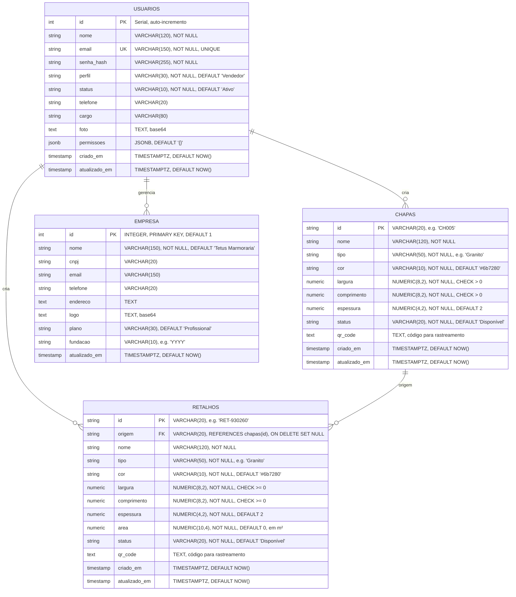

# 🗄️ Diagrama Entidade-Relacionamento (ER) — TetusManager v4

## 📊 Modelo de Dados Completo



---

## 🔗 Relacionamentos Detalhados

### 1️⃣ **USUARIOS → CHAPAS** (One-to-Many)
- Um usuário pode criar múltiplas chapas ✓
- Rastreia quem criou cada chapa
- Não há Foreign Key na tabela, mas há logs

### 2️⃣ **USUARIOS → RETALHOS** (One-to-Many)
- Um usuário pode criar múltiplos retalhos ✓
- Rastreia quem criou cada retalho
- Não há Foreign Key na tabela, mas há logs

### 3️⃣ **CHAPAS ← RETALHOS** (One-to-Many)
- Uma chapa pode gerar múltiplos retalhos (cortes) ✓
- **Foreign Key:** `retalhos.origem` → `chapas.id`
- **ON DELETE SET NULL:** Se chapa é deletada, retalhos mantêm origem como NULL
- **Integridade Referencial:** Retalho não pode ter chapa origem que não existe

### 4️⃣ **USUARIOS ← EMPRESA** (One-to-One)
- Empresa é gerenciada por múltiplos usuários (Admin)
- Apenas 1 registro de empresa (CONSTRAINT id = 1)

---

## 📐 Dimensões & Cálculos

### **Chapa**
```
Dimensões:
  - Largura: 0 a 9999.99 cm
  - Comprimento: 0 a 9999.99 cm
  - Espessura: 0.01 a 99.99 mm (default = 2mm)

Exemplo:
  Chapa "CH005" = 300cm × 150cm × 2mm = Granito Branco
```

### **Retalho**
```
Dimensões:
  - Largura: 0 a 9999.99 cm
  - Comprimento: 0 a 9999.99 cm
  - Espessura: 0.01 a 99.99 mm (default = 2mm)
  - Área: Calculada automaticamente = (largura × comprimento) / 10000

Fórmula da Área:
  area (m²) = (largura (cm) × comprimento (cm)) / 10000

Exemplo:
  Retalho "RET-930260" de ChPA "CH005"
  Dimensões consumidas = 20cm × 20cm
  Área = (20 × 20) / 10000 = 0.04 m²
```

---

## 🔐 Segurança de Dados

### **Passwords (USUARIOS)**
```sql
-- Campo: senha_hash (VARCHAR(255))
-- Algoritmo: bcryptjs
-- Rounds: 10 (default)
-- Hash de exemplo: $2a$10$N9qo8uLOickgx2ZMRZoMyeIjZAgcg7b3XeKeUxWdeS86E36P4/gqe
-- Nunca armazenar senha em plain text ❌
-- Sempre usar bcrypt.compare() para validación ✓
```

### **Permissões (USUARIOS)**
```sql
-- Campo: permissoes (JSONB)
-- Exemplo para Estoquista:
{
  "verDashboard": true,
  "verEstoque": true,
  "editarEstoque": true,
  "registrarCorte": true,
  "verRelatorios": false,
  "gerenciarUsuarios": false,
  "verConfiguracoes": true,
  "verEmpresa": false
}

-- Validação em cada request:
middleware.requirePerm('editarEstoque')
  ├─ Extrai req.user.permissoes
  ├─ Verifica se permissoes.editarEstoque === true
  └─ Bloqueia com 403 Forbidden se false
```

---

## 📝 Triggers & Automação

### **Trigger: set_updated_at()**
```sql
CREATE OR REPLACE FUNCTION set_updated_at()
RETURNS TRIGGER AS $$
BEGIN
  NEW.atualizado_em = NOW();  -- Atualiza timestamp automaticamente
  RETURN NEW;
END;
$$ LANGUAGE plpgsql;

-- Aplicado em:
CREATE TRIGGER trg_usuarios_updated BEFORE UPDATE ON usuarios
  FOR EACH ROW EXECUTE FUNCTION set_updated_at();

CREATE TRIGGER trg_chapas_updated BEFORE UPDATE ON chapas
  FOR EACH ROW EXECUTE FUNCTION set_updated_at();

CREATE TRIGGER trg_retalhos_updated BEFORE UPDATE ON retalhos
  FOR EACH ROW EXECUTE FUNCTION set_updated_at();
```

---

## 🔍 Índices para Performance

```sql
-- Busca por email de usuário (frequente no login)
CREATE INDEX idx_usuarios_email ON usuarios (email);

-- Busca por perfil (autorização)
CREATE INDEX idx_usuarios_perfil ON usuarios (perfil);

-- Busca por status de chapa
CREATE INDEX idx_chapas_status ON chapas (status);

-- Busca por status de retalho
CREATE INDEX idx_retalhos_status ON retalhos (status);

-- Busca por chapa origem (retalhos de uma chapa)
CREATE INDEX idx_retalhos_origem ON retalhos (origem);
```

**Benefícios:**
- ↩️ Queries mais rápidas
- 💾 Menos I/O de disco
- ⚡ Performance melhor em produçao

---

## 📊 Cardinalidade

```
USUARIOS (1) ──── (∞) CHAPAS
  1 usuário para N chapas

USUARIOS (1) ──── (∞) RETALHOS
  1 usuário para N retalhos

CHAPAS (1) ──── (∞) RETALHOS
  1 chapa para N retalhos (origem)

USUARIOS (1) ── (1) EMPRESA
  Múltiplos usuários, 1 empresa
```

---

## 🗂️ Constraints (Restrições)

### **USUARIOS**
```sql
PRIMARY KEY (id)
UNIQUE (email)                    -- Emails não duplicados
CHECK (perfil IN (...))           -- Perfil válido
CHECK (status IN ('Ativo','Inativo'))
```

### **CHAPAS**
```sql
PRIMARY KEY (id)
CHECK (largura > 0)               -- Largura > 0
CHECK (comprimento > 0)           -- Comprimento > 0
CHECK (status IN (...))           -- Status válido
```

### **RETALHOS**
```sql
PRIMARY KEY (id)
FOREIGN KEY (origem) REFERENCES chapas(id) ON DELETE SET NULL
CHECK (largura >= 0)              -- Largura >= 0 (pode ser 0)
CHECK (comprimento >= 0)          -- Comprimento >= 0
CHECK (status IN (...))           -- Status válido
```

### **EMPRESA**
```sql
PRIMARY KEY (id)
CONSTRAINT empresa_singleton CHECK (id = 1)  -- Apenas 1 registro!
```

---

## 🔄 Estados Válidos

### **USUARIOS.status**
```
┌─────────────┬────────────────────────────────┐
│   Status    │         Significado             │
├─────────────┼────────────────────────────────┤
│ "Ativo"     │ Pode fazer login e acessar     │
│ "Inativo"   │ Bloqueado, sem acesso          │
└─────────────┴────────────────────────────────┘
```

### **CHAPAS.status**
```
┌──────────────┬────────────────────────────────┐
│   Status     │         Significado             │
├──────────────┼────────────────────────────────┤
│ "Disponível" │ Pode ser cortada               │
│ "Em uso"     │ Já foi iniciado corte          │
│ "Esgotada"   │ Não pode mais ser cortada      │
└──────────────┴────────────────────────────────┘
```

### **RETALHOS.status**
```
┌──────────────┬────────────────────────────────┐
│   Status     │         Significado             │
├──────────────┼────────────────────────────────┤
│ "Disponível" │ Pronto para venda               │
│ "Reservado"  │ Já tem cliente interessado      │
│ "Consumido"  │ Já foi vendido (soft delete)    │
└──────────────┴────────────────────────────────┘
```

### **USUARIOS.perfil**
```
┌────────────────┬──────────────────────────────┐
│     Perfil     │    Acesso Máximo             │
├────────────────┼──────────────────────────────┤
│ "Administrador"│ Acesso total ao sistema      │
│ "Estoquista"   │ Ver/editar estoque, cortes   │
│ "Vendedor"     │ Apenas visualizar estoque    │
└────────────────┴──────────────────────────────┘
```

---

## 💾 Exemplos de Dados

### **USUARIOS**
```sql
INSERT INTO usuarios (id, nome, email, senha_hash, perfil, status, permissoes)
VALUES (
  1,
  'João Admin',
  'admin@tetusmanager.com',
  '$2a$10$...bcrypt_hash...',
  'Administrador',
  'Ativo',
  '{
    "verDashboard": true,
    "verEstoque": true,
    "editarEstoque": true,
    "registrarCorte": true,
    "verRelatorios": true,
    "gerenciarUsuarios": true,
    "verConfiguracoes": true,
    "verEmpresa": true
  }'
);
```

### **CHAPAS**
```sql
INSERT INTO chapas (id, nome, tipo, largura, comprimento, espessura, status)
VALUES (
  'CH005',
  'Granito Branco',
  'Granito',
  300.00,
  150.00,
  2.00,
  'Disponível'
);
```

### **RETALHOS (criado após corte)**
```sql
INSERT INTO retalhos (id, origem, nome, tipo, largura, comprimento, espessura, area, status)
VALUES (
  'RET-930260',
  'CH005',
  'CH005 - Projeto ABC',
  'Granito',
  20.00,
  20.00,
  2.00,
  0.0400,  -- (20 × 20) / 10000
  'Disponível'
);
```

---

## 🔐 Integridade Referencial

### **Scenario: Deletar Chapa**

```
DELETE FROM chapas WHERE id = 'CH005'
    ↓
FOREIGN KEY: retalhos.origem → chapas.id
CONSTRAINT: ON DELETE SET NULL
    ↓
Retalhos com origem = 'CH005'
  → origem = NULL
  → Dados preservados ✓
  → Histórico mantido ✓
```

**Resultado:**
```sql
-- Depois do delete:
SELECT * FROM retalhos WHERE id = 'RET-930260';

-- Retorna:
┌───────────────┬────────┬──────────┬─────────┐
│      id       │ origem │   nome   │ status  │
├───────────────┼────────┼──────────┼─────────┤
│ RET-930260    │ NULL   │ ...      │ ...     │
└───────────────┴────────┴──────────┴─────────┘

-- NULL significa: "chapa de origem foi deletada"
```

---

## 📈 Escalabilidade

### **Particionamento Futuro**
```sql
-- Para milhões de retalhos, pode-se particionar por status:
CREATE TABLE retalhos_disponiveis PARTITION OF retalhos
  FOR VALUES IN ('Disponível');

CREATE TABLE retalhos_consumidos PARTITION OF retalhos
  FOR VALUES IN ('Consumido');

-- Melhora performance em queries grandes
```

---

## 🔍 Queries Comuns

### **1. Listar retalhos de uma chapa**
```sql
SELECT * FROM retalhos
WHERE origem = 'CH005'
ORDER BY criado_em DESC;
```

### **2. Total de área disponível**
```sql
SELECT SUM(area) as area_total
FROM retalhos
WHERE status = 'Disponível';
```

### **3. Retalhos criados por usuário (se tiver log)**
```sql
SELECT u.nome, COUNT(r.id) as total_retalhos
FROM usuarios u
LEFT JOIN retalhos r ON r.usuario_id = u.id  -- Se tiver campo usuario_id
WHERE r.criado_em >= NOW() - INTERVAL '30 days'
GROUP BY u.nome
ORDER BY total_retalhos DESC;
```

### **4. Chapas disponíveis**
```sql
SELECT * FROM chapas
WHERE status = 'Disponível'
ORDER BY criado_em DESC;
```

### **5. Usuários com permissão 'editarEstoque'**
```sql
SELECT id, nome, email
FROM usuarios
WHERE permissoes -> 'editarEstoque' = 'true'
  AND status = 'Ativo';
```

---

## 📊 Estatísticas do Banco

```sql
-- Total de registros por tabela
SELECT 'usuarios' as tabela, COUNT(*) as total FROM usuarios
UNION ALL
SELECT 'chapas', COUNT(*) FROM chapas
UNION ALL
SELECT 'retalhos', COUNT(*) FROM retalhos
UNION ALL
SELECT 'empresa', COUNT(*) FROM empresa;

-- Espaço ocupado
SELECT 
  schemaname,
  tablename,
  pg_size_pretty(pg_total_relation_size(schemaname||'.'||tablename)) as size
FROM pg_tables
WHERE schemaname = 'public'
ORDER BY pg_total_relation_size(schemaname||'.'||tablename) DESC;
```

---

## 🚀 Otimizações Implementadas

✅ **Índices** na busca por email, status  
✅ **Foreign Keys** com ON DELETE SET NULL  
✅ **Triggers** para atualizar timestamps automaticamente  
✅ **Constraints** para validar dados na entrada  
✅ **JSONB** para permissões (flexível + indexável)  
✅ **Pool de Conexões** pg-pool (até 20 conexões)  
✅ **Prepared Statements** previnem SQL Injection  
✅ **Soft Delete** para retalhos (não deleta, marca como Consumido)

---

**Gerado em:** 2026-05-15  
**Versão do PostgreSQL:** 14+  
**Total de Tabelas:** 4  
**Total de Índices:** 5  
**Total de Triggers:** 3

