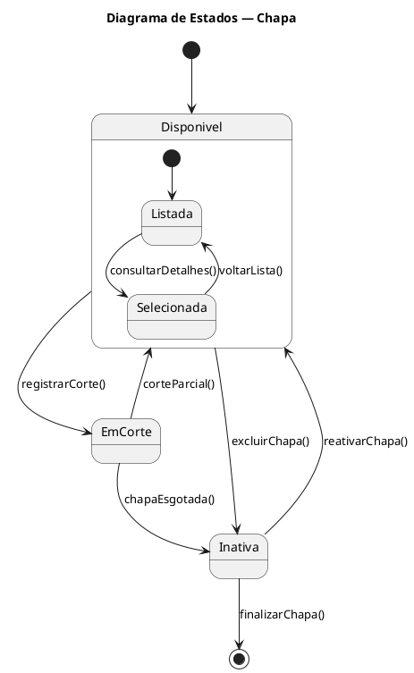
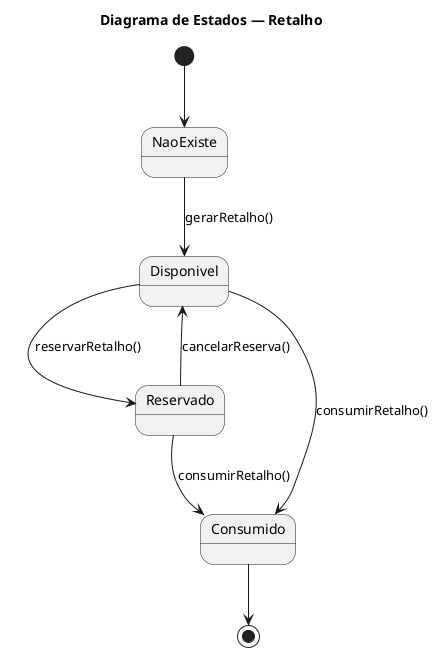
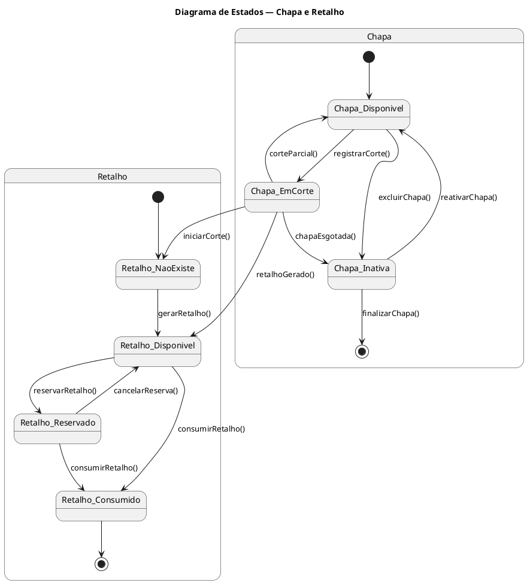

# Diagramas de Estado (PlantUML)

## Versao 1 — Chapa (inclui corte/retalho como transicao)



## Versao 2 — Retalho (gerado a partir da chapa)



## Versao 3 — Unificado (Chapa + Retalho em um unico diagrama)



````
This is the description of what the code block changes:
<changeDescription>
Adiciona estado final para a Chapa nas versoes 1 e 3.
</changeDescription>

This is the code block that represents the suggested code change:
````markdown
# Diagramas de Estado (PlantUML)

## Versao 1 — Chapa (inclui corte/retalho como transicao)


## Versao 2 — Retalho (gerado a partir da chapa)


## Versao 3 — Unificado (Chapa + Retalho em um unico diagrama)


