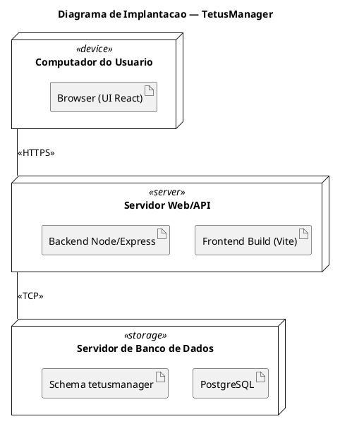

# Diagrama de Implantacao (PlantUML)

```plantuml
@startuml
title Diagrama de Implantacao — TetusManager

node "Computador do Usuario" <<device>> as Client {
  artifact "Browser (UI React)" as Browser
}

node "Servidor Web/API" <<server>> as AppServer {
  artifact "Frontend Build (Vite)" as FrontendBuild
  artifact "Backend Node/Express" as BackendApp
}

node "Servidor de Banco de Dados" <<storage>> as DbServer {
  artifact "PostgreSQL" as Postgres
  artifact "Schema tetusmanager" as Schema
}

Client -- AppServer : <<HTTPS>>
AppServer -- DbServer : <<TCP>>

@enduml
```

