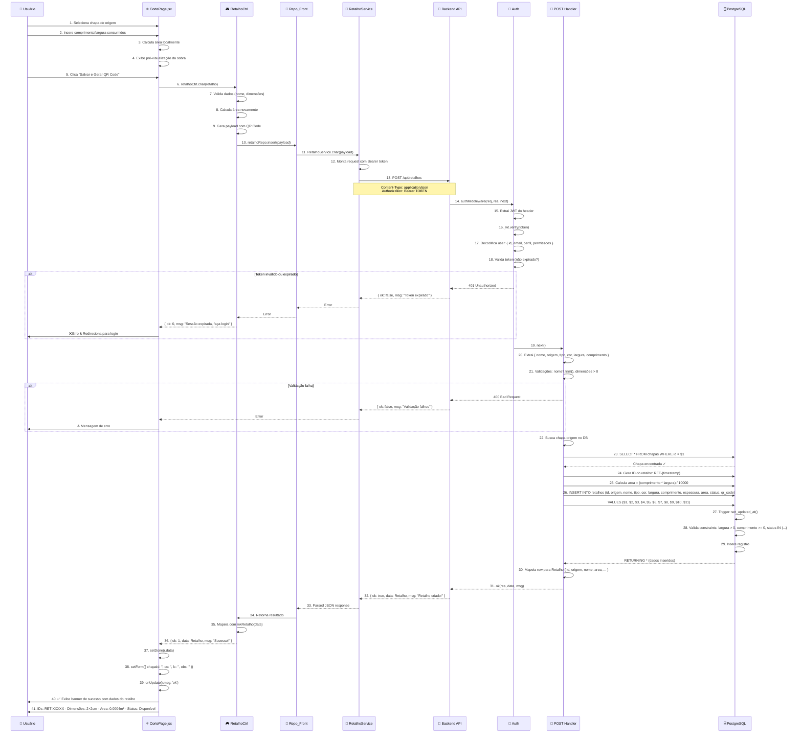
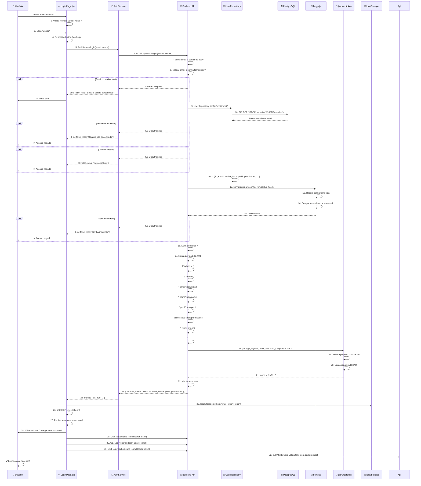
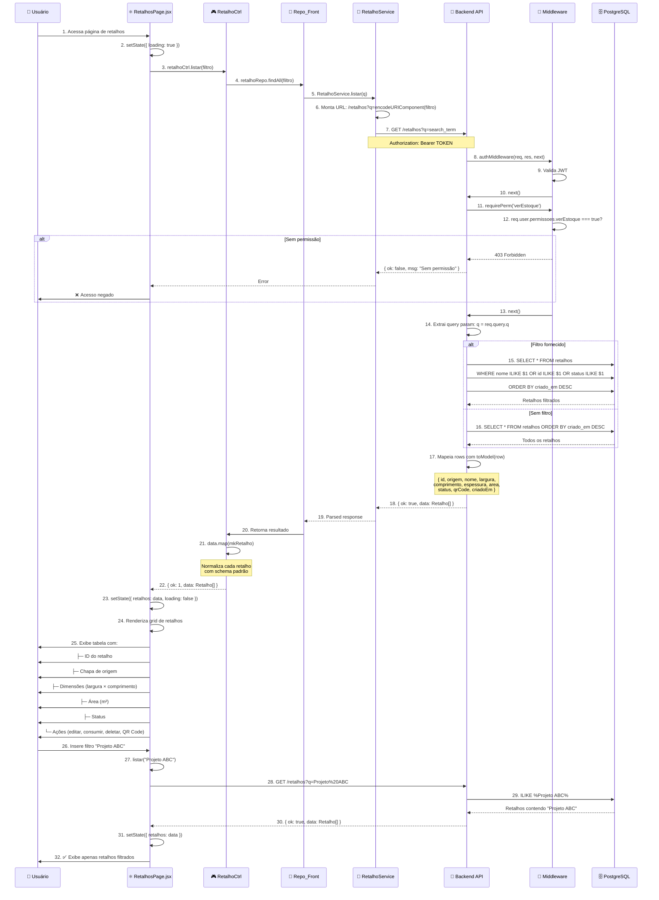
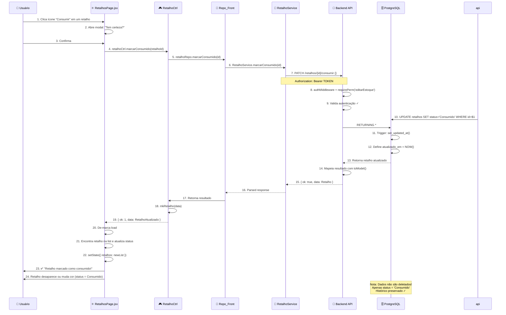
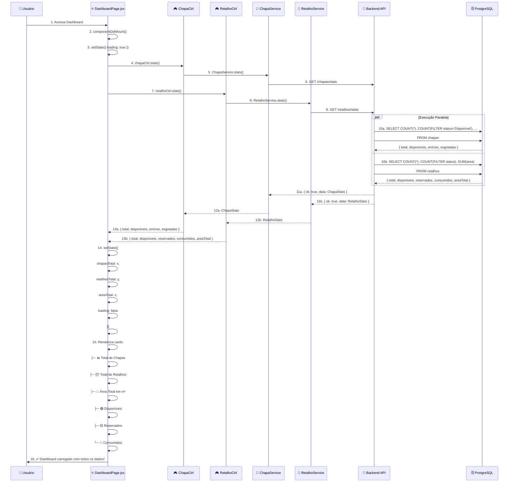
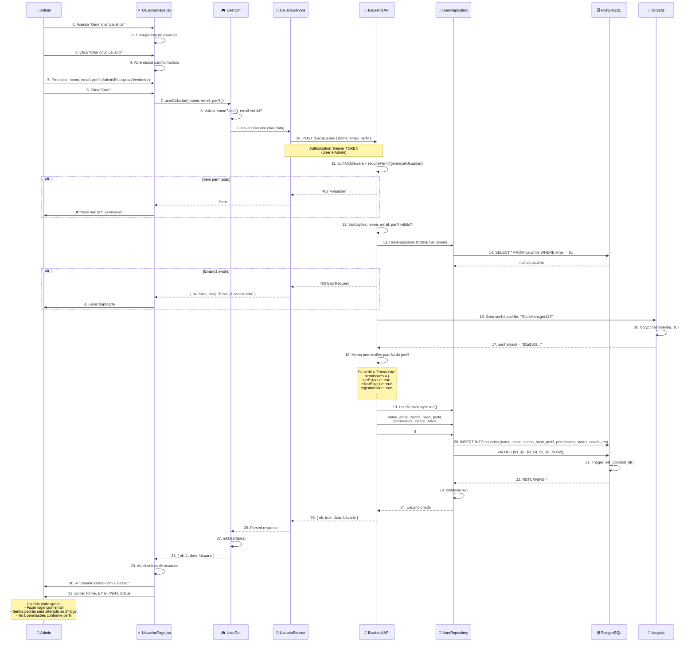

# 🔄 Diagramas de Sequência — TetusManager v4

## 📊 Fluxos Detalhados com Diagramas de Sequência

### 1️⃣ Registrar Corte (Criar Retalho a partir de Chapa)



---

### 2️⃣ Login e Autenticação



---

### 3️⃣ Listar e Filtrar Retalhos



---

### 4️⃣ Consumir Retalho (Soft Delete)



---

### 5️⃣ Dashboard — Carregamento de Stats



---

### 6️⃣ Gerenciar Usuários & Permissões



---

## 🔑 Padrões de Response

Toda resposta da API segue o padrão:

```javascript
// Sucesso
{ 
  ok: true, 
  data: { ... }, 
  msg: "Operação realizada com sucesso!" 
}

// Erro
{ 
  ok: false, 
  msg: "Descrição do erro",
  status: 400 // ou 401, 403, 404, 500
}
```

---

## ⏱️ Timeouts & Performance

- **JWT Expira em:** 8 horas
- **Timeout de Requisição:** 30 segundos
- **Pool de Conexões:** 20 conexões simultâneas
- **Cache de Dados**: localStorage (token)

---

**Gerado em:** 2026-05-15  
**Total de Fluxos Documentados:** 6  
**Complexidade:** Alta

