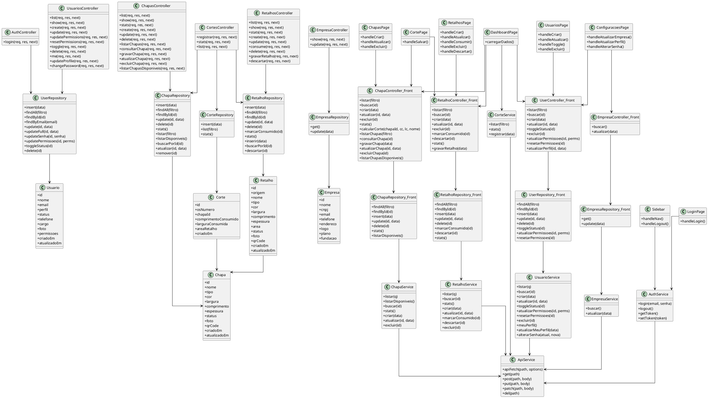

# Diagrama de Classes Unificado (PlantUML)

```plantuml
@startuml
skinparam classAttributeIconSize 0
skinparam linetype ortho

' =========================
' BACKEND
' =========================
class AuthController {
  +login(req, res, next)
}

class ChapasController {
  +list(req, res, next)
  +show(req, res, next)
  +stats(req, res, next)
  +create(req, res, next)
  +update(req, res, next)
  +delete(req, res, next)
  +listarChapas(req, res, next)
  +consultarChapa(req, res, next)
  +gravarChapa(req, res, next)
  +atualizarChapa(req, res, next)
  +excluirChapa(req, res, next)
  +listarChapasDisponiveis(req, res, next)
}

class RetalhosController {
  +list(req, res, next)
  +show(req, res, next)
  +stats(req, res, next)
  +create(req, res, next)
  +update(req, res, next)
  +consume(req, res, next)
  +delete(req, res, next)
  +gravarRetalho(req, res, next)
  +descartar(req, res, next)
}

class CortesController {
  +registrar(req, res, next)
  +stats(req, res, next)
  +list(req, res, next)
}

class UsuariosController {
  +list(req, res, next)
  +show(req, res, next)
  +create(req, res, next)
  +update(req, res, next)
  +updatePermissions(req, res, next)
  +resetPermissions(req, res, next)
  +toggle(req, res, next)
  +delete(req, res, next)
  +me(req, res, next)
  +updateProfile(req, res, next)
  +changePassword(req, res, next)
}

class EmpresaController {
  +show(req, res, next)
  +update(req, res, next)
}

class ChapaRepository {
  +insert(data)
  +findAll(filtro)
  +findById(id)
  +update(id, data)
  +delete(id)
  +stats()
  +listar(filtro)
  +listarDisponiveis()
  +buscarPorId(id)
  +atualizar(id, data)
  +remover(id)
}

class RetalhoRepository {
  +insert(data)
  +findAll(filtro)
  +findById(id)
  +update(id, data)
  +delete(id)
  +marcarConsumido(id)
  +stats()
  +inserir(data)
  +buscarPorId(id)
  +descartar(id)
}

class CorteRepository {
  +insert(data)
  +list(filtro)
  +stats()
}

class UserRepository {
  +insert(data)
  +findAll(filtro)
  +findById(id)
  +findByEmail(email)
  +update(id, data)
  +updateFull(id, data)
  +updateSenha(id, senha)
  +updatePermissoes(id, perms)
  +toggleStatus(id)
  +delete(id)
}

class EmpresaRepository {
  +get()
  +update(data)
}

class Chapa {
  +id
  +nome
  +tipo
  +cor
  +largura
  +comprimento
  +espessura
  +status
  +foto
  +qrCode
  +criadoEm
  +atualizadoEm
}

class Retalho {
  +id
  +origem
  +nome
  +tipo
  +cor
  +largura
  +comprimento
  +espessura
  +area
  +status
  +foto
  +qrCode
  +criadoEm
  +atualizadoEm
}

class Corte {
  +id
  +osNumero
  +chapaId
  +comprimentoConsumido
  +larguraConsumida
  +areaRetalho
  +criadoEm
}

class Usuario {
  +id
  +nome
  +email
  +perfil
  +status
  +telefone
  +cargo
  +foto
  +permissoes
  +criadoEm
  +atualizadoEm
}

class Empresa {
  +id
  +nome
  +cnpj
  +email
  +telefone
  +endereco
  +logo
  +plano
  +fundacao
}

' =========================
' FRONTEND
' =========================
class ChapaController_Front {
  +listar(filtro)
  +buscar(id)
  +criar(data)
  +atualizar(id, data)
  +excluir(id)
  +stats()
  +calcularCorte(chapaId, cc, lc, nome)
  +listarChapas(filtro)
  +consultarChapa(id)
  +gravarChapa(data)
  +atualizarChapa(id, data)
  +excluirChapa(id)
  +listarChapasDisponiveis()
}

class RetalhoController_Front {
  +listar(filtro)
  +buscar(id)
  +criar(data)
  +atualizar(id, data)
  +excluir(id)
  +marcarConsumido(id)
  +descartar(id)
  +stats()
  +gravarRetalho(data)
}

class UserController_Front {
  +listar(filtro)
  +buscar(id)
  +criar(data)
  +atualizar(id, data)
  +toggleStatus(id)
  +excluir(id)
  +atualizarPermissoes(id, perms)
  +resetarPermissoes(id)
  +atualizarPerfil(id, data)
}

class EmpresaController_Front {
  +buscar()
  +atualizar(data)
}

class ChapaRepository_Front {
  +findAll(filtro)
  +findById(id)
  +insert(data)
  +update(id, data)
  +delete(id)
  +stats()
  +listarDisponiveis()
}

class RetalhoRepository_Front {
  +findAll(filtro)
  +findById(id)
  +insert(data)
  +update(id, data)
  +delete(id)
  +marcarConsumido(id)
  +descartar(id)
  +stats()
}

class UserRepository_Front {
  +findAll(filtro)
  +findById(id)
  +insert(data)
  +update(id, data)
  +delete(id)
  +toggleStatus(id)
  +atualizarPermissoes(id, perms)
  +resetarPermissoes(id)
}

class EmpresaRepository_Front {
  +get()
  +update(data)
}

class ApiService {
  +apiFetch(path, options)
  +get(path)
  +post(path, body)
  +put(path, body)
  +patch(path, body)
  +del(path)
}

class ChapaService {
  +listar(q)
  +listarDisponiveis()
  +buscar(id)
  +stats()
  +criar(data)
  +atualizar(id, data)
  +excluir(id)
}

class RetalhoService {
  +listar(q)
  +buscar(id)
  +stats()
  +criar(data)
  +atualizar(id, data)
  +marcarConsumido(id)
  +descartar(id)
  +excluir(id)
}

class CorteService {
  +listar(filtro)
  +stats()
  +registrar(data)
}

class UsuarioService {
  +listar(q)
  +buscar(id)
  +criar(data)
  +atualizar(id, data)
  +toggleStatus(id)
  +atualizarPermissoes(id, perms)
  +resetarPermissoes(id)
  +excluir(id)
  +meuPerfil()
  +atualizarMeuPerfil(data)
  +alterarSenha(atual, nova)
}

class EmpresaService {
  +buscar()
  +atualizar(data)
}

class AuthService {
  +login(email, senha)
  +logout()
  +getToken()
  +setToken(token)
}

class DashboardPage {
  +carregarDados()
}

class ChapasPage {
  +handleCriar()
  +handleAtualizar()
  +handleExcluir()
}

class RetalhosPage {
  +handleCriar()
  +handleAtualizar()
  +handleConsumir()
  +handleExcluir()
  +handleDescartar()
}

class CortePage {
  +handleSalvar()
}

class UsuariosPage {
  +handleCriar()
  +handleAtualizar()
  +handleToggle()
  +handleExcluir()
}

class ConfiguracoesPage {
  +handleAtualizarEmpresa()
  +handleAtualizarPerfil()
  +handleAlterarSenha()
}

class LoginPage {
  +handleLogin()
}

class Sidebar {
  +handleNav()
  +handleLogout()
}

' =========================
' RELACIONAMENTOS
' =========================
AuthController --> UserRepository
ChapasController --> ChapaRepository
RetalhosController --> RetalhoRepository
CortesController --> ChapaRepository
CortesController --> RetalhoRepository
CortesController --> CorteRepository
UsuariosController --> UserRepository
EmpresaController --> EmpresaRepository

ChapaRepository --> Chapa
RetalhoRepository --> Retalho
CorteRepository --> Corte
UserRepository --> Usuario
EmpresaRepository --> Empresa
Retalho --> Chapa
Corte --> Chapa

ChapaController_Front --> ChapaRepository_Front
RetalhoController_Front --> RetalhoRepository_Front
UserController_Front --> UserRepository_Front
EmpresaController_Front --> EmpresaRepository_Front

ChapaRepository_Front --> ChapaService
RetalhoRepository_Front --> RetalhoService
UserRepository_Front --> UsuarioService
EmpresaRepository_Front --> EmpresaService

ChapaService --> ApiService
RetalhoService --> ApiService
CorteService --> ApiService
UsuarioService --> ApiService
EmpresaService --> ApiService
AuthService --> ApiService

DashboardPage --> ChapaController_Front
DashboardPage --> RetalhoController_Front
DashboardPage --> UserController_Front
DashboardPage --> CorteService

ChapasPage --> ChapaController_Front
RetalhosPage --> RetalhoController_Front
CortePage --> ChapaController_Front
CortePage --> RetalhoController_Front
UsuariosPage --> UserController_Front
ConfiguracoesPage --> EmpresaController_Front
ConfiguracoesPage --> UserController_Front
LoginPage --> AuthService
Sidebar --> AuthService
@enduml
```

