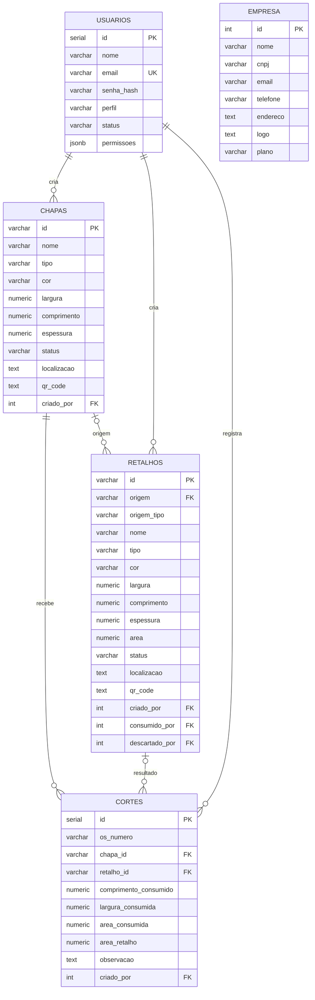

# Diagrama de Entidades — TetusManager v1.2

Modelo lógico alinhado às especificações de caso de uso revisadas.

## Regras importantes

- `RETALHOS.origem` é opcional para peças manuais/legadas.
- `RETALHOS.origem_tipo` usa `AUTOMATICA` ou `MANUAL`.
- `CORTES.retalho_id` é opcional porque um corte pode consumir a chapa sem gerar sobra reutilizável.
- `CHAPAS.localizacao` e `RETALHOS.localizacao` são opcionais.
- Chapas e retalhos utilizam exclusão lógica para preservar rastreabilidade.
