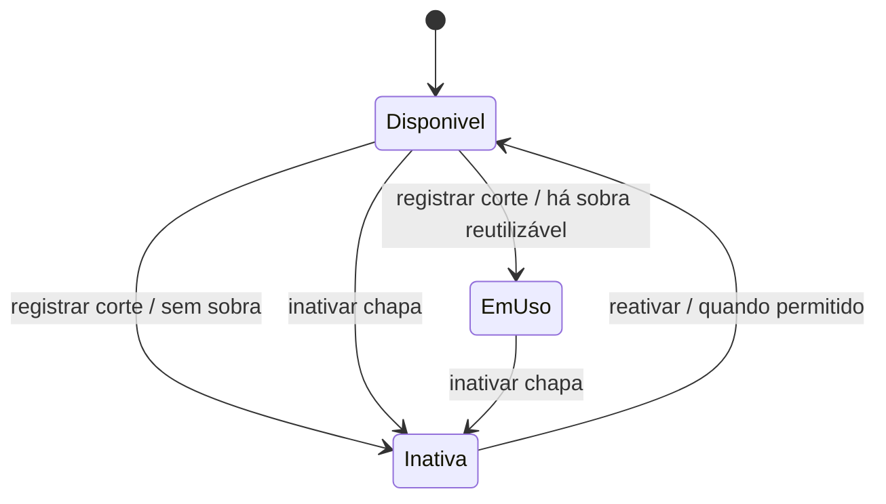
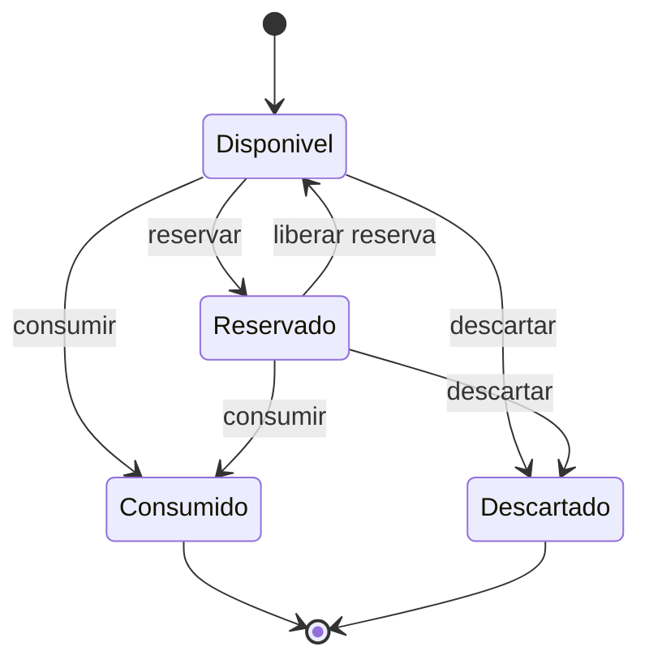

# Diagrama de Estados — TetusManager v1.2

Versão alinhada às especificações oficiais. Chapa e Retalho possuem ciclos de vida distintos.

## Chapa

Estados persistidos:

- `Disponível`
- `Em uso`
- `Inativa`

A inativação é lógica e preserva cortes e retalhos relacionados.

## Retalho

Estados persistidos:

- `Disponível`
- `Reservado`
- `Consumido`
- `Descartado`

Retalhos consumidos e descartados permanecem no banco para rastreabilidade.
