# Diagramas oficiais — TetusManager v1.2

Este arquivo consolida a versão dos diagramas compatível com as especificações UC01–UC08 revisadas. Os blocos PlantUML podem ser importados/replicados no Astah mantendo os mesmos participantes e mensagens.

## 1. Diagrama geral de casos de uso

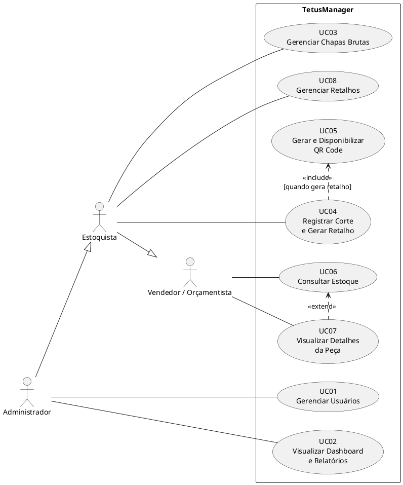

## 2. Diagrama de estados — Chapa

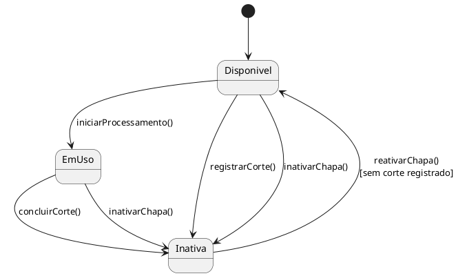

> Ao concluir o UC04, a chapa de origem termina em `Inativa`. Quando existe sobra reutilizável, apenas o novo retalho representa a área física restante no estoque.

## 3. Diagrama de estados — Retalho

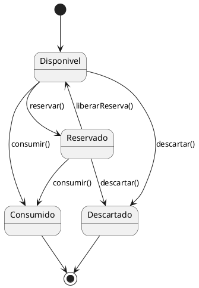

## 4. Sequência UC01 — Gerenciar Usuários

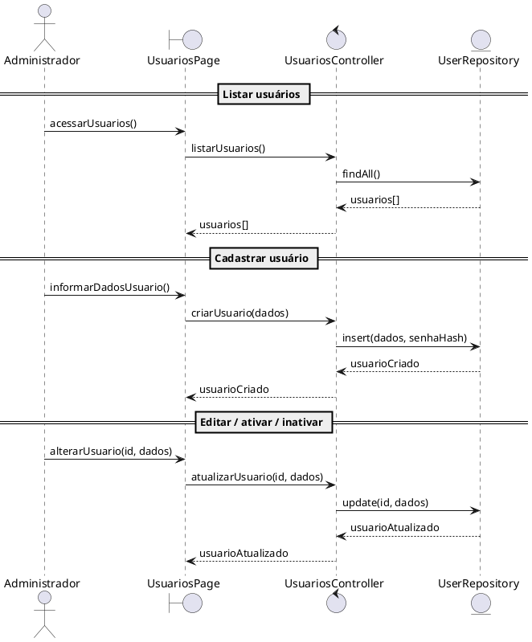

## 5. Sequência UC02 — Visualizar Dashboard e Relatórios

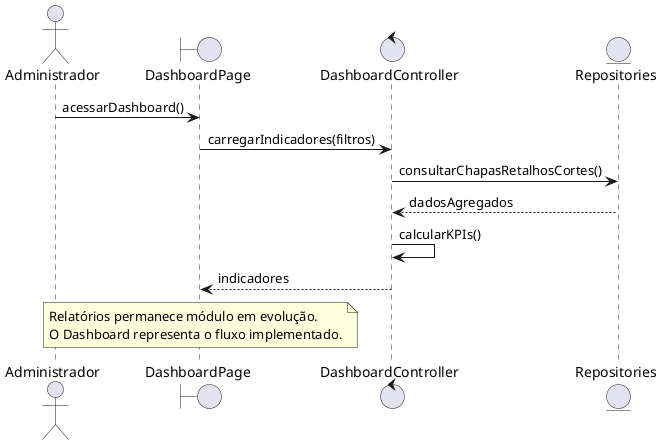

## 6. Sequência UC03 — Gerenciar Chapas Brutas

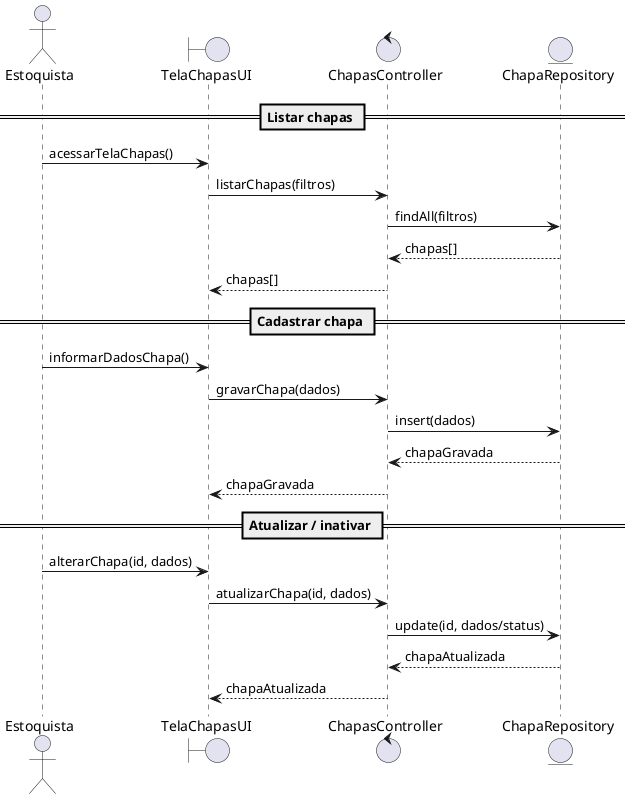

## 7. Sequência UC04 — Registrar Corte e Gerar Retalho

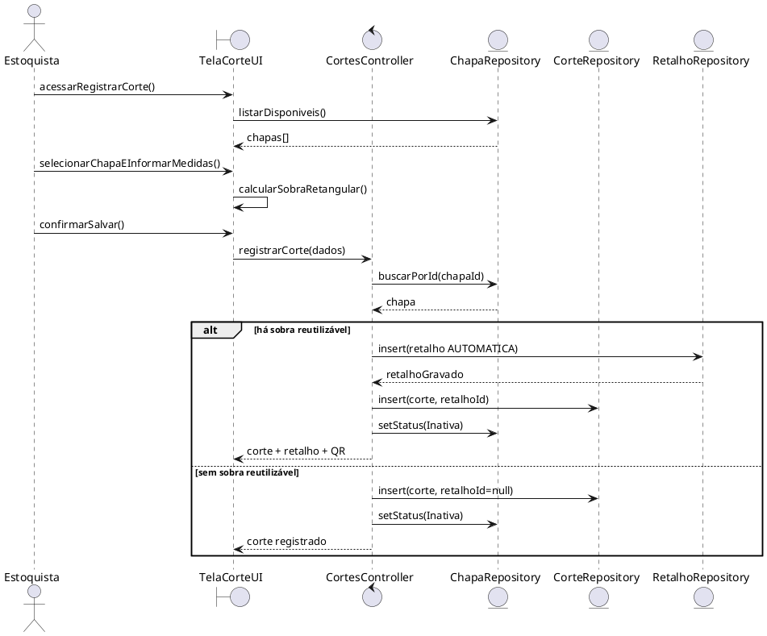

## 8. Sequência UC05 — Gerar e Disponibilizar QR Code

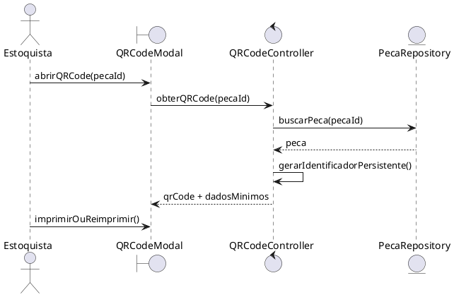

## 9. Sequência UC06 — Consultar Estoque

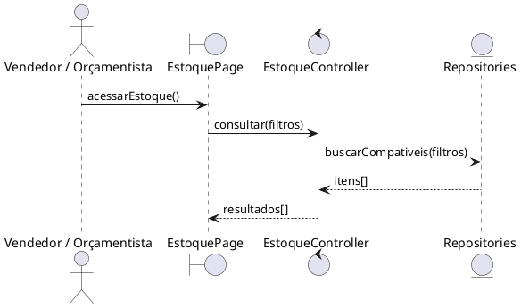

## 10. Sequência UC07 — Visualizar Detalhes da Peça

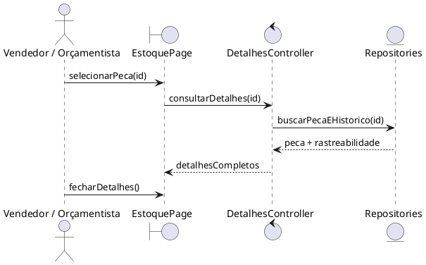

## 11. Sequência UC08 — Gerenciar Retalhos

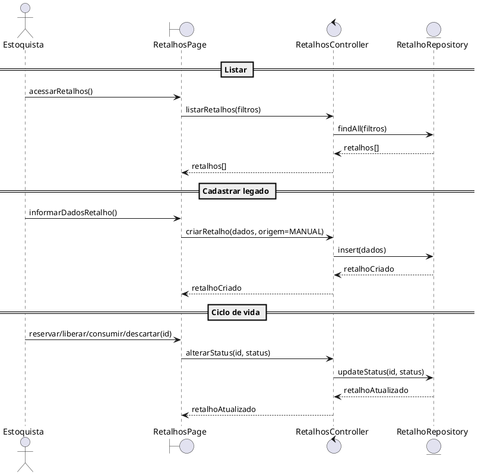

## 12. DER lógico atualizado

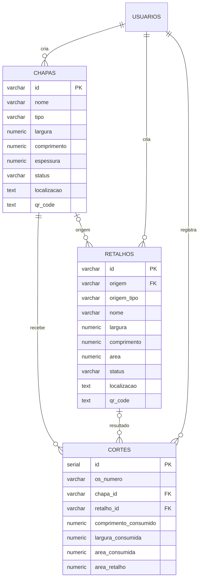

## 13. Implantação

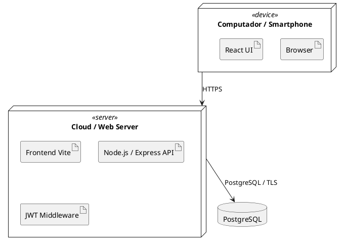
